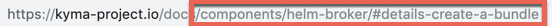

# Links in docs

These are the guidelines for making cross-references between the documents in the [`kyma/docs`](https://github.com/kyma-project/kyma/tree/master/docs) folder.

>**NOTE:** The linking works only on the [Kyma website](https://kyma-project.io/docs). Currently, the cross-references between [GitHub documentation](https://github.com/kyma-project/kyma/tree/master/docs) is not available.

## Links between documents in the same topic

If you want to link to another document in the same topic, create a reference using the `#{type}-{title}-{header}` pattern, where:
- `{type}` is a metadata type of the document that you want to reference.
- `{title}` is a metadata title of the document that you want to reference.
- `{header}` is a header located in the document that you want to reference.

>**NOTE:** All variables must consist of lowercase characters separated with dashes (-).

If the `{type}` doesn't exist, the pattern has the form of `#{title}-{title}-{header}`. If you want to create a reference to the whole `{type}`, use the `#{type}-{type}` pattern.

>**TIP:** You can copy the reference to the documentation directly from the website. See the reference to the Helm Broker **Details** document:

### Links to the assets folder

To add a reference to a YAML, JSON, SVG, PNG, or JPG file located in the `assets` folder in the same topic, use GitHub relative links. For example, write `[Here](./assets/mf-namespaced.yaml) you can find a sample micro front-end entity.` When you click such a link on the `kyma-project.io` website, it opens the file content in the same tab.

## Links between documents in different topics

If you want to link to a document in a different topic, create a reference using the `/{type-of-topic}/{id}#{type}-{title}-{header}` pattern, where:
- `{type-of-topic}` is a type of topic that you want to reference. Apart from documents related directly to Kyma, all components have the `components` type of topic. For Kyma, use `root` in place of topic type.
- `{id}` is an ID of the topic that you want to reference. It is identical with the name of the component. For example, write `helm-broker` or `kyma`.
- `{type}` is a metadata type of the document that you want to reference.
- `{title}` is a metadata title of the document that you want to reference.
- `{header}` is a header located in the document that you want to reference.

>**NOTE:** All variables must consist of lowercase characters separated with dashes (-).

If the `{type}` doesn't exist, the pattern has the form of `/{type-of-topic}/{id}#{title}-{title}-{header}`. If you want to create a reference to the whole `{type}`, use the `/{type-of-topic}/{id}#{type}-{type}` pattern.

>**TIP:** You can copy the reference to the documentation directly from the website. See the cross-topic references to the Helm Broker **Details** document and to the Kyma **Overview**:

## Links in documentation toggle

To link to document inside the documentation toggle it needs to start with `
` and end with `
` HTML tags, where `{NAME}` is optional distinctive ID used for links. Use of toggle is explained in detail in [this](./documentation-toggle.md) document.

If you want to link to a document in a documentation toggle, create an appropriate reference using instructions from previous sections, additionally adding `--{toggle-name}--{tab-name}--{header}`, where 
- `{toggle-name}` is value added to specific toggle in `name` attribute
- `{tab-name}` is the title of the tab containing desired header
- `{header}` is a header located in the document that you want to reference.

Use lowercase Kebab-Case for those variables, changing any character that is not letter or number into `-`, cutting trailing `-` that emerged in a process and squashing consecutive `-` into one `-`.

Example: 
1. header `Choose the release to install` becomes `choose-the-release-to-install`
2. `Lorem ipsum dolor sit (amet)` becomes `lorem-ipsum-dolor-sit-amet`

Example: https://kyma-project.io/docs/master#installation-install-kyma-on-a-cluster--provider-installation--gke--choose-the-release-to-install in which:
- `{toggle-name}` is `provider-installation`
- `{tab-name}` is `gke`
- `{header}` is `choose-the-release-to-install`
