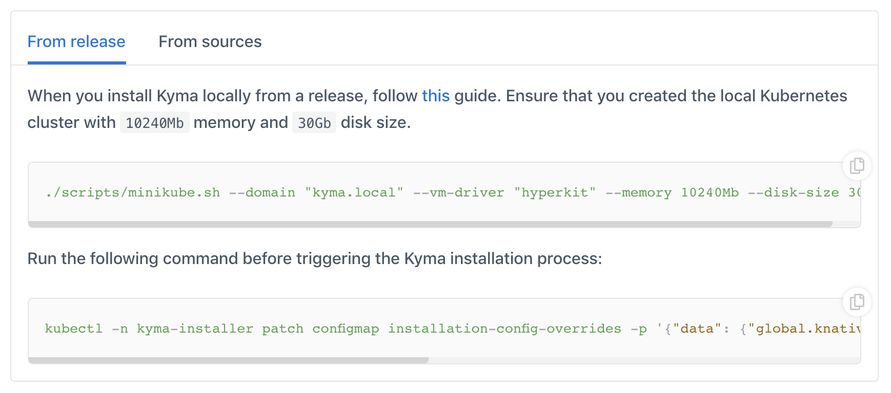

# Toggle

These are the guidelines for making documentation toggle (usually for content dependent on chosen OS).

## Writing rules

* Toggles belonging to one group must start with `<div tabs>` and end with `</div>` html tags.
* Single to must starts with `<details>` tag and ends with `</details>` tag.
* Title of toggle must be between `<summary>` and `</summary>` tag. Every part of title must    starts in a new line. Example:
  ``` markdown
  <summary>
  From release
  </summary>
  ```
* After `</summary>` tag, must be blank line (otherwise content not be rendered).
* Content can write in markdown.
* Indentation with flat structure:
  - for the div element: 0 spaces.
  - for other elements: 2 spaces.
* Indentation using list:
  - for the div element: 4 spaces.
  - for other elements: 6 spaces.

## Examples

See the exemplary markdown code for reference:

* Example 1 (flat structure)

<div tabs>
  <details>
  <summary>
  From release
  </summary>

  When you install Kyma locally from a release, follow [this](#installation-install-kyma-locally-from-the-release-install-kyma-on-minikube) guide. 
  Ensure that you created the local Kubernetes cluster with `10240Mb` memory and `30Gb` disk size.
  ```
  ./scripts/minikube.sh --domain "kyma.local" --vm-driver "hyperkit" --memory 10240Mb --disk-size 30g
  ```

  Run the following command before triggering the Kyma installation process:
  ```
  kubectl -n kyma-installer patch configmap installation-config-overrides -p '{"data": {"global.knative": "true", "global.kymaEventBus": "false", "global.natsStreaming.clusterID": "knative-nats-streaming"}}'
  ```
  </details>
  <details>
  <summary>
  From sources
  </summary>

  When you install Kyma locally from sources, add the `--knative` argument to the `run.sh` script. Run this command:

  ```
  ./run.sh --knative
  ```
  </details>
</div>


Rendered version in `kyma-project.io`:



* Example 2 (with list)

1. First element
2. Second element
    <div tabs>
      <details>
      <summary>
      From release
      </summary>

      When you install Kyma locally from a release, follow [this](#installation-install-kyma-locally-from-the-release-install-kyma-on-minikube) guide. 
      Ensure that you created the local Kubernetes cluster with `10240Mb` memory and `30Gb` disk size.
      ```
      ./scripts/minikube.sh --domain "kyma.local" --vm-driver "hyperkit" --memory 10240Mb --disk-size 30g
      ```

      Run the following command before triggering the Kyma installation process:
      ```
      kubectl -n kyma-installer patch configmap installation-config-overrides -p '{"data": {"global.knative": "true", "global.kymaEventBus": "false", "global.natsStreaming.clusterID": "knative-nats-streaming"}}'
      ```
      </details>
      <details>
      <summary>
      From sources
      </summary>

      When you install Kyma locally from sources, add the `--knative` argument to the `run.sh` script. Run this command:

      ```
      ./run.sh --knative
      ```
      </details>
    </div>


Rendered version in `kyma-project.io`:


