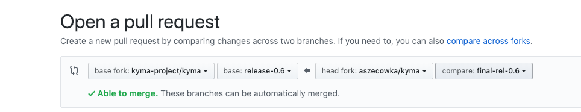

This document describes how to create a Kyma release. Start from defining release jobs as described in the [**Preparation**](#kyma-release-process-kyma-release-process-preparation) section. Then proceed to the [**Steps**](#kyma-release-process-kyma-release-process-steps).

A Kyma release includes the following items:

* Docker images for Kyma components
* A GitHub release including release artifacts, such as source code and configuration
* A Git tag
* A release branch

## Definitions
In the context of the following document we will use:
**RELEASE**: Release number in the form `{major}.{minor}` (e.g. `1.13`)
**RELEASE_VERSION**: Release version in the form `{major}.{minor}.{patch}` (eg. `1.13.0`) or `{major}.{minor}.{patch}-rc{candidate}` (eg. `1.13.0-rc1`) 
**RELEASE_VERSION_SHORT**: Release version in the form `{major}{minor}` (e.g. `113`)
**RELEASE_VERSION_DASH**: Release version in the form `{major}-{minor}-{patch}` (e.g. `1-13-0`) or `{major}-{minor}-{patch}-rc{candidate}` (e.g. `1-13-0-rc1`)


## Preparation

> **NOTE:** This section applies only to new major and minor versions. If you release a patch, skip the preparation and go to the [**Steps**](#kyma-release-process-kyma-release-process-steps) section.

To prepare a release:

1. Before you create the relase branch you can check if it contains any PR-images:
   
   ```bash
   git grep -e 'version:\s*[Pp][Rr]-.*' -e 'image:.*:[Pp][Rr]-.*' --before-context=2 -r resources
   ```
  
   If this command returns any output inform the teams

1. Create a release branch in the `kyma` repository. The name of this branch should follow the `release-{major}.{minor}` pattern, such as `release-1.4`.

   ```bash
    git fetch upstream
    git checkout -b release-{RELEASE} upstream/master
    git push upstream release-{RELEASE}
    ```

   > **NOTE:** If you don't create the Kyma release branch at this point and add a  `post-rel{RELEASE_VERSION_SHORT}-kyma-release-candidate` post-submit job to the `test-infra` master, then pushing anything to the Kyma release branch, creating or rebasing the branch, triggers a new GitHub release.

2. [Define new release jobs](#kyma-release-process-kyma-release-process-preparation-define-new-release-jobs) in the `test-infra` repository.

### Define new release jobs

1. Go to the `test-infra` repository.
2. Open `templates/config.yaml`
3. Add the new release to `global.releases`. Remove the oldest release on the list.
4. Set `global.nextRelease` to the future release version.
5. Run `make` in the root of the repository to generate jobs and run tests. If any of the tests is marked red, fix it using these guidelines:
  * For release tests using `GetKymaReleasesSince` or `jobsuite.Since` with a release that is no longer supported, change the method to `GetAllKymaReleases` or `jobsuite.AllReleases` respectively.
  * For release tests using `GetKymaReleasesUntil` or `jobsuite.Until` with a release that is no longer supported, remove the part of the test which includes the method.
6. If tests are green, commit all jobs. The new release jobs are ready.

## Steps
Follow these steps to release another Kyma version.

### kyma-project/test-infra

1. Create a release branch in the `test-infra` repository. The name of this branch should follow the `release-x.y` pattern, such as `release-1.4`.

   > **NOTE:** This step applies only to new major and minor versions.

   ```bash
   git fetch upstream
   git checkout -b release-{RELEASE} upstream/master
   ```

2. Ensure that the `prow/RELEASE_VERSION` file from the `test-infra` repository on a release branch contains the correct version to be created. If you define a release candidate version, a pre-release is created.  

   Make sure the `RELEASE_VERSION` file includes just a single line, **without the newline character at the end**:  

   ```bash
   echo -n {RELEASE_VERSION} > prow/RELEASE_VERSION
   ```

3. Push the branch to the `test-infra` repository.

4. Update the `RELEASE_VERSION` file with the name of the next minor release candidate and merge the pull request to `master`. For example, if the `RELEASE_VERSION` on the `master` branch is set to `1.4.2`, then change the version to `1.5.0-rc1`.

### kyma-project/kyma

1. Inside the release branch do the following changes.

   1. In `installation/resources/installer.yaml` replace `eu.gcr.io/kyma-project/develop/installer:{image_tag}` with `eu.gcr.io/kyma-project/kyma-installer:{RELEASE_VERSION}`

   2. Find these lines in `tools/kyma-installer/kyma.Dockerfile`:

   ```
   ARG INSTALLER_VERSION="{kyma_operator_version}"
   ARG INSTALLER_DIR={kyma_operator_path}
   FROM $INSTALLER_DIR/kyma-operator:$INSTALLER_VERSION
   ```

   Replace them with:

   ```
   FROM {kyma_operator_path}/kyma-operator:master-{kyma_operator_version}
   ```

   3. In the `resources/core/values.yaml` file, replace the `clusterAssetGroupsVersion` value with your release branch name. For example, for the 1.4 release, find the following section:

   ```yaml
   docs:
   # (...) - truncated
   clusterAssetGroupsVersion: master
   ```

   And replace the `clusterAssetGroupsVersion` value with the following:

   ```yaml
   docs:
   # (...)
   clusterAssetGroupsVersion: release-1.4
   ```

   . Create a pull request with your changes to the release branch.

   

2. If `pre-release-pr-image-guard` fails, ask the owners to change PR-XXX images of the components to the master version.

   > **CAUTION:** Never use `/test all` as it might run tests that you do not want to execute.

3. Execute remaining tests. There are dependencies between jobs, so follow the provided order of steps.

   1.  Run `kyma-integration` by adding the  `/test pre-rel{RELEASE_VERSION_SHORT}-kyma-integration`  comment to the PR.

    > **NOTE:** You don't have to wait until the `pre-rel{RELEASE_VERSION_SHORT}-kyma-integration` job finishes to proceed with further jobs.

   2. Execute the next steps in the following order
       1. Run `/test pre-rel{RELEASE_VERSION_SHORT}-kyma-installer` and wait until it finishes.
       2. Run `/test pre-rel{RELEASE_VERSION_SHORT}-kyma-artifacts` and wait until it finishes.
       3. Run the following tests in parallel and wait for them to finish:

            ```
            /test pre-rel{RELEASE_VERSION_SHORT}-kyma-gke-integration
            /test pre-rel{RELEASE_VERSION_SHORT}-kyma-gke-central-connector
            /test pre-rel{RELEASE_VERSION_SHORT}-kyma-gke-upgrade
            ```

4. If you detect any problems with the release, such as failing tests, wait for the fix that can be either delivered on a PR or cherry-picked to the PR from the `master` branch. Prow triggers the jobs again. Rerun manual jobs as described in **step 3**.

5. After all checks pass, merge the PR, using the `rebase and merge` option.

   > **CAUTION:** By default, the `rebase and merge` option is disabled. Contact one of the `kyma-project/kyma` repository admins to enable it.

6. Merging the PR to the release branch runs the postsubmit jobs, which:

   * create a GitHub release and trigger documentation update on the official Kyma website
   * trigger provisioning of the cluster from the created release. Use the cluster to test the release candidate.

   > **CAUTION**: The cluster is automatically generated for you, but removal is a manual action. The release cluster, the IP Addresses, and the DNS records must be deleted manually after tests on the given cluster are done.

   If you don't have access to the GCP project, post a request in the Slack team channel.

   ```bash
   gcloud container clusters get-credentials gke-{RELEASE_VERSION_DASH} --zone europe-west4-c --project sap-kyma-prow-workloads
   ```

   Follow [these](https://kyma-project.io/docs/#installation-install-kyma-with-your-own-domain-access-the-cluster) instructions to give Kyma teams access to start testing the release candidate.

7. The Github release postsumbit job creates a tag in the `kyma-project/kyma` repository, which triggers the [`post-kyma-release-upgrade`](https://github.com/kyma-project/test-infra/blob/master/prow/jobs/kyma/kyma-release-upgrade.yaml) pipeline. The purpose of this job is to test upgradability between the previous Kyma release, i.e. the latest release that is not a release candidate, and the brand new release published by the release postsubmit job.
    
    For example, if `1.7.0-rc2` is released, the pipeline will try to upgrade `1.6.0` to `1.7.0-rc2`.
    
    If you detect any problems with the upgrade, contact the teams responsible for failing components.
    
    > **CAUTION:** The job assumes no manual migration is involved. If the upgrade process requires any additional actions, the pipeline is likely to fail. In such case, the owners of the components concerned are responsible for running manual tests or modifying the pipeline.

8. Update the `RELEASE_VERSION` file to contain the next patch RC1 version on the release branch. Do it immediately after the release, otherwise, any PR to a release branch overrides the previously published Docker images.

   For example, if the `RELEASE_VERSION` file on the release branch contains `1.4.1`, change it to `1.4.2-rc1`.

9. Validate the `yaml` and changelog files generated under [releases](https://github.com/kyma-project/kyma/releases).

10. Update the release content manually with links to:

   - Instructions on local Kyma installation
   - Instructions on cluster Kyma installation
   - Release notes

   For installation instructions, use the links from the previous release and update the version number in URLs. If contributors want you to change something in the instructions, they would address you directly. Contact technical writers for the link to release notes.

11. Create a spreadsheet with all open issues labeled as `test-missing`. Every team assigned to an issue must cover the outstanding test with manual verification on every release candidate. After the test is finished successfully, the responsible team must mark it as completed in the spreadsheet. Every issue identified during testing must be reported. To make the testing easier, provision a publicly available cluster with the release candidate version after you complete all steps listed in this document.

> **NOTE:** After the Kyma release is complete, proceed with [releasing Kyma CLI](/guidelines/releases-guidelines/03-kyma-cli-release-process.md).
