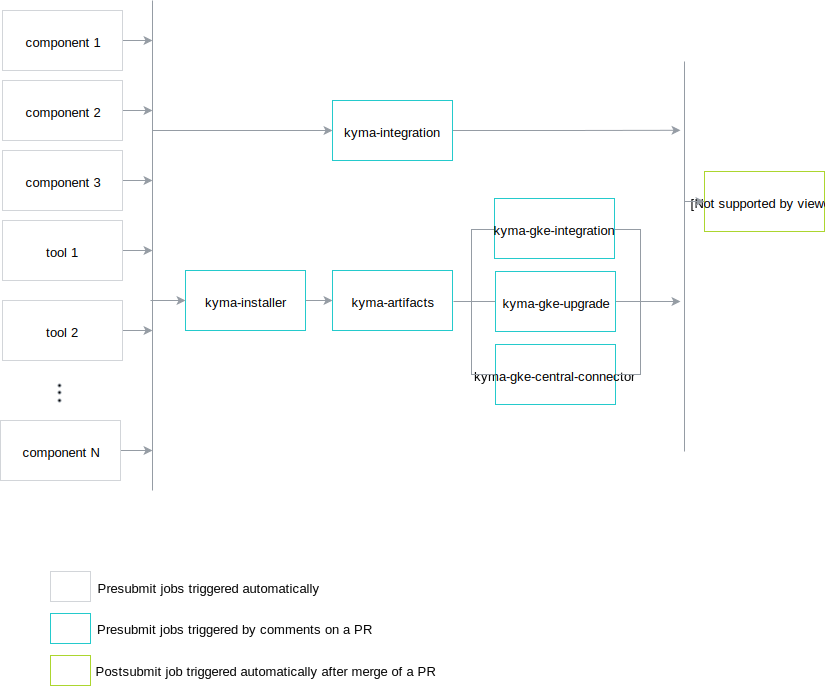

This document explains how a new Kyma and also new Kyma CLI release can be introduced.

## Kyma

### Release Information

A Kyma release consists of the following things:
* Docker images for Kyma components
* Github release
  * Release artifacts such as source code and configuration
* Git tag
* Release branch

### Changes to test-infra repository

#### Steps for new major/minor version

Define release jobs on the `master` branch in the `test-infra` repository. To ensure every job name is unique, prefix it with `pre-rel{versionNumber}`. Remember to provide the version number without any periods. For example, to find all jobs for the 1.4 release, look for job names with the `pre-rel14` prefix. To learn how to define a release job for a component, read the following [document](https://github.com/kyma-project/test-infra/blob/master/docs/prow/release-jobs.md).

1. Navigate to the `test-infra` repository.
1. Define release jobs in the `prow/jobs/test-infra` directory in the `watch-pods.yaml` file.
1. Define release jobs in the `prow/jobs/kyma` directory in the following files:
   - every `.yaml` in `components` 
   - every `.yaml` in `tests`
   - every `.yaml` in `tools/` **except for** the `tools/failery/failery.yaml` file
   - `kyma-integration.yaml`
   - `kyma-artifacts.yaml`
   - `kyma-installer.yaml`
   - `kyma-release-candidate.yaml`
   - `kyma-github-release.yaml`
      For this file also do the following steps:

	  - Modify the `presets` array. This is an example of the 1.4 release `preset`:
		
		```yaml
		- labels:
		    preset-target-commit-1.4: "true"
		    env:
		    - name: RELEASE_TARGET_COMMIT
		        value: release-1.4
		```
  
	  -  Remember to also set the `preset-target-commit-1.4` label for the `post-rel14-kyma-github-release` job. This is an example of the 1.4 release `postsubmit` job:

        ```yaml
        postsubmits: 
          kyma-project/kyma:
          - name: post-rel14-kyma-github-release
            branches:
            - release-1.4
            <<: *job_template
            extra_refs:
            - <<: *test_infra_ref
              base_ref: release-1.4
            labels:
              <<: *job_labels_template
              preset-build-release: "true"
              preset-target-commit-1.4: "true"
        ```  

1. Ensure that tests for the release jobs exist. Release tests usually iterate through all release versions and run tests for them.
See the `TestBucReleases` test defined in `development/tools/jobs/kyma/service_binding_usage_controller_test.go` as a reference.

1. Update the `GetAllKymaReleaseBranches()` function
defined in the `development/tools/jobs/tester/tester.go` file under the `test-infra` repository.

1. Define branch protection rules for the release branch in the `prow/config.yaml` file.
	For example, see the release-1.4 definition:

	```yaml
    release-1.4:
	  protect: true
      required_status_checks:
        contexts:
          - pre-rel14-kyma-integration
          - pre-rel14-kyma-gke-integration
          - pre-rel14-kyma-gke-upgrade
          - pre-rel14-kyma-gke-central-connector
          - pre-rel14-kyma-artifacts
          - pre-rel14-kyma-installer
          - pre-rel14-kyma-gke-minio-gateway
	```
 
1. Remove the now unsupported release in `tester.go` and all references of it. E.g `Release12 SupportedRelease = "release-1.2"` when releasing 1.5.
 
##### Remove previous release jobs

After adding new release jobs, remove the old ones. Remember to leave jobs for three latest releases. For example, during the preparation for the 1.4 release, add `pre-rel14` jobs and remove all `pre-rel11` jobs. Make sure that the only defined jobs are those with `pre-rel12`, `pre-rel13`, and `pre-rel14` prefixes.

> **NOTE:** Currently, you are most likely required to push to the `release-x.y` branch more than once. Make sure that a user with **admin** role is present in the `kyma` repository.

Before a release, make sure there is no mismatch between source code and `.yaml` files. All components are rebuilt from source code, which requires all Helm charts to be up to date.

##### Create release branch

1. Create a release branch in the `test-infra` repository. The name of this branch should follow the `release-x.y` pattern, such as `release-1.4`.

	```bash
	git fetch upstream
	git checkout -b $RELEASE_NAME upstream/master
	```

#### Steps for new release candidate

>**NOTE:** This point applies for new release candidates such as rc1, rc2 and the final version.

1. Ensure that the `prow/RELEASE_VERSION` file from the `test-infra` repository on a release branch contains the correct version to be created. The file should contain a release version following the `{A}.{B}.{C}` or `{A}.{B}.{C}-rc{D}` format, where `A`,`B`, `C`, and `D` are numbers. If you define a release candidate version, a pre-release is created.  

	Make sure the `RELEASE_VERSION` file includes just this single line:  
	```bash
	echo -n {RELEASE_VERSION} > prow/RELEASE_VERSION
	```

1. Push the branch to the `test-infra` repository.

1. Create a PR to `test-infra/release-x.y`. This triggers the pre-release job for `watch-pods`. 

	> **NOTE:** To trigger the `watch-pods` build without introducing any changes, edit any file within the `test-infra` repository and create a pull request. You don't need to merge it as the job is triggered anyway. After a successful `watch-pods` image build, close the pull request.

1. Update the `RELEASE_VERSION` file with the name of the next minor release candidate and merge the pull request to `master`. For example, if the `RELEASE_VERSION` on the `master` branch is set to `1.4.2`, then change the version to `1.5.0-rc1`.


### Changes to Kyma repository

#### Steps for new major/minor version

1. Create a release branch in the `kyma` repository.

	Do it only for major and minor releases.
	The name of this branch should follow the `release-x.y` pattern, such as `release-1.4`.

	```bash
	git fetch upstream
	git checkout -b release-{release_version} upstream/master
	git push upstream release-{release_version}
	```

	> **NOTE:** If you push anything to the release branch (includes creating of the branch), or if you rebase the branch, a new Github release is created. This is because of the post-submit job `post-rel14-kyma-release-candidate` in `kyma-github-release.yaml` and only happens if you already merged the test-infra changes.

1. Create a new branch and do the following changes.
	1. In  the `resources/core/values.yaml` file, replace the `clusterDocsTopicsVersion` value with your release branch name. For example, for the 1.4.1 release, find the following section:

		```yaml
		docs:
		    # (...) - truncated
		    clusterDocsTopicsVersion: master
		```

		And replace the `clusterDocsTopicsVersion` value with the following:

		```yaml
		docs:
		    # (...)
		    clusterDocsTopicsVersion: release-1.4
		```
  
#### Steps for new release candidate

>**NOTE:** This point applies for new release candidates such as rc1, rc2 and the final version.

1. Inside your new branch do the following changes.

	1. Update your PR with the version and the directory of components used in `values.yaml` files.

		Find these values in the files:

		```yaml
		dir: develop/
		version: {current_version}
		```
  
		```yaml
		dir: pr/
		version: {current_version}
		```

		Replace them with:

		```yaml
		dir:
		version: {release_version}
		```

		> **NOTE:** Replace only `develop/` so `develop/tests` becomes `tests/`.

		Every component image is published with a version defined in the `RELEASE_VERSION` file stored in the `test-infra` repository on the given release branch. Test scripts for integration jobs like GKE Integration or GKE Upgrade are also loaded from the `test-infra` release branch.

		For example, for the first release candidate of 1.1.0, the release version will be `1.1.0-rc1` and the `yaml` files should be modified as follows:
		``` yaml
		dir:
		version: 1.1.0-rc1
		```
		> **CAUTION**: Do **not** update the version of components whose `dir` section does not contain `develop`, as is the case with Console-related components. Also do not change octopus image in `kyma/resources/testing/values.yaml` even though it has `develop`.

	1. Check all `yaml` files in the `kyma` repository for references of the following Docker image:

		```yaml
		image: eu.gcr.io/kyma-project/develop/{IMAGE_NAME}:{SOME_SHA}
		```

		Change the Docker image to:
		```yaml
		image: eu.gcr.io/kyma-project/{IMAGE_NAME}:{release_version}
		```

		> **CAUTION**: In `installation/resources/installer.yaml` replace `eu.gcr.io/kyma-project/develop/installer:{image_tag}` with `eu.gcr.io/kyma-project/kyma-installer:{release_version}`
                                                                                                                                                                                                                                                                                                   >
	1. Create a pull request with your changes to the release branch. It triggers all jobs for components.

		

1. If any job fails, trigger it again by adding the following comment to the PR:

	```
	/test {job_name}
	```

	> **CAUTION:** Never use `/test all` as it might run tests that you do not want to execute.

1. Wait until all jobs for components and tools finish.
1. Execute remaining tests. The diagram shows you the jobs and dependencies between them.
	
	1. Run `kyma-integration` by adding the  `/test pre-{release_number}-kyma-integration`  comment to the PR.

		> **NOTE:** You don't have to wait until the `pre-{release_number}-kyma-integration` job finishes to proceed with further jobs.

	1. Run `/test pre-{release_number}-kyma-installer` and wait until it finishes.
	1. Run `/test pre-{release_number}-kyma-artifacts` and wait until it finishes.
    1. Run the following tests in parallel:
       ```bash
       /test pre-rel14-kyma-gke-integration
       /test pre-rel14-kyma-gke-upgrade
       /test pre-rel14-kyma-gke-backup
       ```
       
	1. Wait for the jobs to finish:
        - `pre-{release_number}-kyma-integration`
        - `pre-{release_number}-kyma-gke-integration`
        - `pre-{release_number}-kyma-gke-upgrade`
        - `pre-{release_number}-kyma-gke-backup`

1. If you detect any problems with the release, such as failing tests, wait for the fix that can be delivered either on a PR or cherry-picked to the PR from the `master` branch.  
	Prow triggers the jobs again. Rerun manual jobs as described in **step 5**.

1. After all checks pass, merge the PR, using the `rebase and merge` option. To merge the PR to the release branch, you must receive approvals from all teams.

    > **CAUTION:** By default, the `rebase and merge` option is disabled. Contact one of the `kyma-project/kyma` repository admins to enable it.
    
1. Merging the PR to the release branch runs the postsubmit jobs, which:
	- create a GitHub release and trigger documentation update on the official Kyma website
	- trigger provisioning of the cluster from the created release
	The cluster name contains the release version with a period `.` replaced by a dash `-`. For example: `gke-release-1-1-0-rc1`. Use the cluster to test the release candidate.
	> **CAUTION**: The cluster is automatically generated for you! You don't need to create it yourself! The release cluster, the IP Addresses, and the DNS records must be deleted manually after tests on the rc2 cluster are finished.
    
    - Get access to the release cluster. If you don't have access to the GCP project, ask someone in the Slack team channel.
    
   ```bash
   gcloud container clusters get-credentials gke-release-1-4-0-rc2 --zone europe-west4-c --project sap-hybris-sf-playground
   ```

   - Follow instructions on [Access the cluster](https://kyma-project.io/docs/#installation-use-your-own-domain-access-the-cluster) and give Kyma teams access to start testing the release candidate.
    
1. Update the `RELEASE_VERSION` file to contain the next patch RC1 version on the release branch. Do it immediately after the release, otherwise, any PR to a release branch overrides the previously published Docker images.

	For example, if the `RELEASE_VERSION` file on the release branch contains `1.4.1`, change it to `1.4.2-rc1`.

1.  Validate the `yaml` and changelog files generated under [releases](https://github.com/kyma-project/kyma/releases).

1. Update the release content manually with links to the instruction on how to install the latest Kyma release.  
	Currently, this means to grab the links from the previous release and update the version number in URLs. If contributors want you to change something in the instruction, they would address you directly.

1. Create a spreadsheet with all open issues labeled as `test-missing`. Every team assigned to an issue must cover the outstanding test with manual verification on every release candidate. After the test is finished successfully, the responsible team must mark it as completed in the spreadsheet. Every issue identified during testing must be reported. To make the testing easier, provision a publicly available cluster with the release candidate version after you complete all steps listed in this document.

## CLI

A release of `cli` consists of:
* bumping the code to a release tag/branch
* creating artifacts (cli binaries and source code archives)
* github release with automated changelog generation

First the current code is pinned in a release branch.
Then the Kyma version is updated to test the integration with the latest Kyma version. Finally cli is released via a git tag which triggers a Github release.


### Steps for new major/minor version

>**NOTE:** This point applies only to new major and minor versions and not for new release candidates such as rc2 when already having rc1.

 After making sure that Kyma is released, create a release branch in the `cli` repository. The name of this branch should follow the `release-x.y` pattern, such as `release-1.4`.

```bash
git fetch upstream
git checkout -b {RELEASE_NAME} upstream/master
git push upstream {RELEASE_NAME}
```

### Steps for new release candidate

>**NOTE:** This point applies for new release candidates such as rc1, rc2 and the final version.

1. Ensure that the `KYMA_VERSION` variables on `Makefile` and `.goreleaser.yml` file from the `cli` repository on the release branch contains the latest Kyma version that you just released.

1. Create a PR to `cli/release-x.y`. This triggers the presubmit job for `cli`.

    >**NOTE:** A CLI release requires Kyma to be released first. Otherwise integration jobs will fail. However anything can be prepared. Just do not merge the PR until Kyma is relesed. Then do a retest and merge the PR.

1. After merging the PR, create a tag on the release branch that has the same version name as Kyma. If you define a release candidate version, a pre-release is created.  

    ```bash
    git tag -a {RELEASE_VERSION} -m "Release {RELEASE_VERSION}"
    git push upstream {RELEASE_VERSION}
    ```
   
   where {RELEASE_VERSION} could be e.g. `1.4.0-rc1`, `1.4.0-rc2` or `1.4.0`.

1. Pushing the tag triggers the postsubmit job that creates the GitHub release. Validate if the release is available under [releases](https://github.com/kyma-project/cli/releases).
