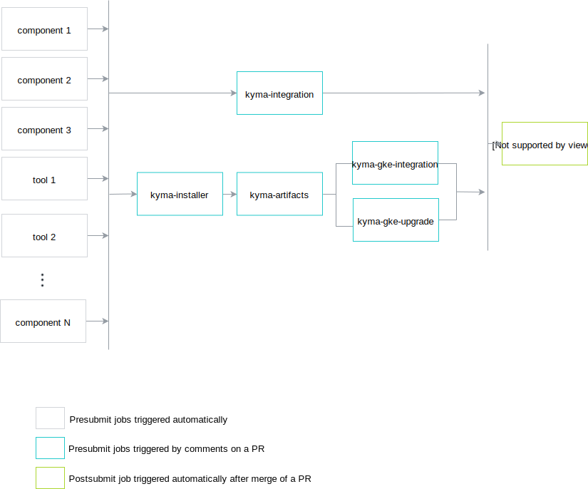

# Release Process

This document describes how to create a Kyma release using Prow.

## Preparation

This section only applies to new major and minor versions. Follow the preparation steps at any point in time.

1. Define these release jobs in the `test-infra` repository:
   - for every component
   - for every tool  
     Exceptions:
     - `prow/jobs/kyma/tools/docsbuilder/docsbuilder.yaml`

   - for every test
   - `kyma-docs`
   - `kyma-integration`
   - `kyma-gke-integration`
   - `kyma-gke-upgrade`
   - `kyma-artifacts`
   - `kyma-installer`

    >**NOTE:** Read [here](https://github.com/kyma-project/test-infra/blob/master/docs/prow/release-jobs.md) how to define a release job for a component.

    To see all release jobs for the 0.6 release, look for job names with the `pre-rel06` prefix.
    Since every job name has to be unique, prefix it with `pre-rel{XY}`.
    Define the release jobs on the `master` branch since Prow reads the job configuration from the `master` branch of the `test-infra` repository.

2. Ensure that tests for release jobs exist. Release tests usually iterate through all release versions and run tests for them.
See the `TestBucReleases` test defined in `development/tools/jobs/kyma/binding_usage_controller_test.go` as a reference.
To add tests for all jobs for the new release, update the `GetAllKymaReleaseBranches()` function
defined in the `development/tools/jobs/tester/tester.go` file under the `test-infra` repository.

3. Define branch protection rules for the release branch in the `prow/config.yaml` file.
    For example, see the release-0.6 definition:

    ```yaml
    release-0.6:
      protect: true
      required_status_checks:
        contexts:
          - pre-rel06-kyma-integration
          - pre-rel06-kyma-gke-integration
          - pre-rel06-kyma-artifacts
          - pre-rel06-kyma-installer
    ```

## Release

> **IMPORTANT:** Never use `/test all` as it might run tests that you do not want to execute!
>
> **NOTE:** Currently, you are most likely required to push to the `release-x.y` branch more than once. Make sure that a user with **admin** role is present in the `kyma` repository. 
> Before every release you need to bump the version in github.com/kyma-project/test-infra `prow/RELEASE_NUMBER`. This requires the approval of a member of wg-prow!  

Follow these steps to create a release:

### kyma-project/test-infra

1. Create a release branch in the `test-infra` repository. The name of this branch should follow the `release-x.y` pattern, such as `release-0.6`.

    ```bash
    git fetch upstream
    git checkout -b $RELEASE_NAME upstream/master
    ```

    >**NOTE:** This point only applies to new major and minor versions.

2. Ensure that the `prow/RELEASE_VERSION` file from the `test-infra` repository on a release branch contains the correct version to be created.
The file should contain a release version following the `{A}.{B}.{C}` or `{A}.{B}.{C}-rc{D}` format, where `A`,`B`, `C`, and `D` are numbers.
If you define a release candidate version, a pre-release is created.

    > **NOTE:** make sure the RELEASE_VERSION file has only one single line:  
    > `echo -n $RELEASE_VERSION > prow/RELEASE_VERSION`

3. Push the branch to the `test-infra`  repository.

4. Create a PR to test-infra/release-X.X. This will trigger the pre-release job for watch-pods

### kyma-project/kyma

1. Create a release branch in the `kyma` repository.
   > **NOTE:** Do it only for a new release, not for a bugfix release.
The name of this branch should follow the `release-x.y` pattern, such as `release-0.6`.

    ```bash
    git fetch upstream
    git checkout -b $RELEASE_NAME upstream/master
    git push upstream $RELEASE_NAME
    ```

2. Create a PR for the `kyma` release branch.
    
    This triggers all jobs for components.

    1. Update your PR with the version and the directory of components used in `values.yaml` files.

        Find these values in the files:

        ```yaml
        dir: develop/
        version: {current_version}
        ```

        Replace them with:

        ```yaml
        dir:
        version: {rel_version}
        ```

        > **NOTE:** replace only `develop/` so `develop/tests` becomes `tests/`

        Every component image is published with a version defined in the `RELEASE_VERSION` file stored in the `test-infra` repository on the given release branch.

    2. Check all `yaml` files for the following references:  
        `image: eu.gcr.io/kyma-project/develop/{{IMAGE_NAME}}:{{SOME_SHA}}`
        and change them to:  
        `image: eu.gcr.io/kyma-project/{{IMAGE_NAME}}:{{RELEASE_NAME}}`

        known files to change:
        - `installation/resources/installer-local.yaml`
        - `installation/resources/watch-pods.yaml`
        - `resources/application-connector-ingress/templates/upgrade-job.yaml`

        Don't change the following file:
        - `installation/resources/installer.yaml`:  

            ```yaml
            apiVersion: extensions/v1beta1
            kind: Deployment
            metadata:
              name: kyma-installer
              namespace: kyma-installer
              labels:
                kyma-project.io/installation: ""
            spec:
              template:
                metadata:
                  labels:
                    name: kyma-installer
                spec:
                  serviceAccountName: kyma-installer
                  containers:
                  - name: kyma-installer-container
                    image: eu.gcr.io/kyma-project/develop/installer:55bc6038
                    imagePullPolicy: IfNotPresent
             ```

3. If any job fails, trigger it again by adding the following comment to the PR:

    ```;
    /test {job_name}
    ```

    > **CAUTION:** Never use `/test all` as it might run tests that you do not want to execute.

4. Wait until all jobs for components and tools finish.
5. Execute remaining tests. The diagram shows you the jobs and dependencies between them.
    
    1. Run `kyma-integration` by adding the  `/test pre-{release_number}-kyma-integration`  comment to the PR.
        > **NOTE:** You don't have to wait until the `pre-{release_number}-kyma-integration` job finishes to proceed with further jobs.

    2. Run `kyma-installer`
    ```/test pre-{release_number}-kyma-installer``` and wait until it finishes
    3. Run `kyma-artifacts`
    ```/test pre-{release_number}-kyma-artifacts``` and wait until it finishes

    4. Run `kyma-gke-integration` and `kyma-gke-upgrade`. You can start them in parallel.
    5. Wait for the jobs to finish:
         - `kyma-integration`
         - `kyma-gke-integration`
         - `kyma-gke-upgrade`

6. If you detect any problems with the release, such as failing tests, wait for the fix that can be delivered either on a PR or cherry-picked to the PR from the `master` branch.  
    Prow triggers the jobs again. Rerun manual jobs as described in **step 5 **.

7. After all checks pass, merge the PR.
    > **NOTE:** To merge the PR to the release branch, you must receive approvals from all teams.

8. Merging the PR to the release branch runs the postsubmit job that creates a GitHub release.

9. Update `RELEASE_VERSION` to the next version both on the `master` and release branches. Do it immediately after the release, otherwise any PR to a release branch overrides the previously published Docker images.

10. Validate the `yaml` and changelog files generated under [releases](https://github.com/kyma-project/kyma/releases).
11. Update the release content manually with the instruction on how to install the latest Kyma release.  
    Currently this means to grab the instructions from the previous release and change the version number in them. If contributors want you to change something in them they would address you directly.


> **NOTE:** All teams should test the release candidate versions. To make the testing easier, provision a publicly available cluster with the release candidate version after performing all steps listed in this document.
