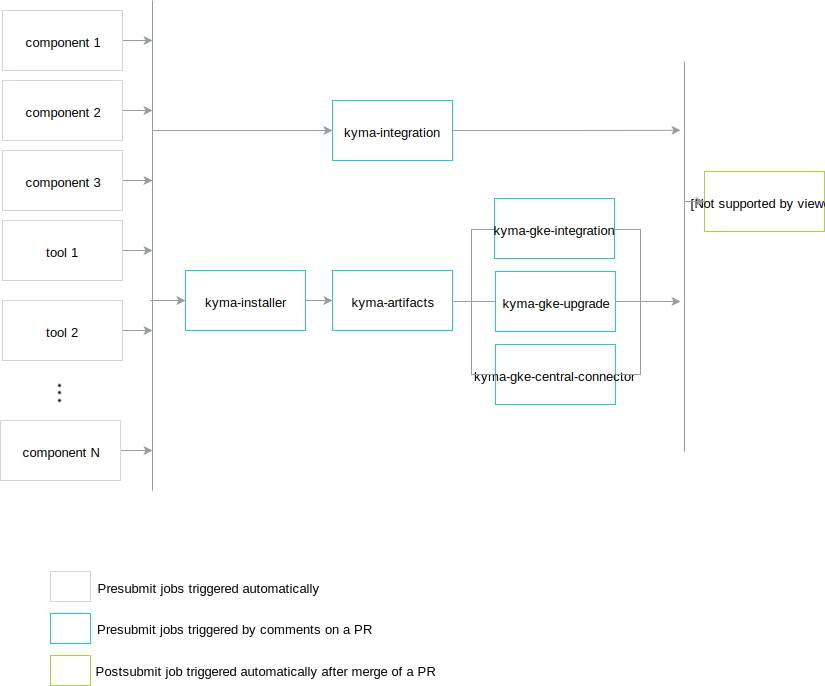

# Release Process

This document describes how to execute a Kyma release using Prow.

## Preparation

This section only applies to new major and minor versions. Follow the preparation steps at any point in time.

1. Define these release jobs in the `test-infra` repository:
 - for every component
 - for every tool
 - for every test
 - `kyma-docs`
 - `kyma-integration`
 - `kyma-gke-integration`
 - `kyma-gke-upgrade`
 - `kyma-artifacts`
 - `kyma-installer`

>**NOTE:** Read [here](https://github.com/kyma-project/test-infra/blob/master/docs/prow/release-jobs.md) how to define a release job for a component.

To see all release jobs for the 0.6 release, look for job names with the `pre-rel06` prefix.
Since every job name has to be unique, prefix it with `pre-rel{XY}`.
Define the release jobs on the `master` branch since Prow reads the job configuration from the `master` branch of the `test-infra` repository.

2. Ensure that tests for release jobs exist. Release tests usually iterate through all release versions and run tests for them.
See the `TestBucReleases` test defined in `development/tools/jobs/kyma/binding_usage_controller_test.go` as a reference.
To add tests for all jobs for the new release, update the `GetAllKymaReleaseBranches()` function
defined in the `development/tools/jobs/tester/tester.go` file under the `test-infra` repository.

3. Define branch protection rules for the release branch in the `prow/config.yaml` file.
For example, see the release-0.6 definition:
```
release-0.6:
  protect: true
  required_status_checks:
    contexts:
      - pre-rel06-kyma-integration
      - pre-rel06-kyma-gke-integration
      - pre-rel06-kyma-artifacts
      - pre-rel06-kyma-installer
```


## Release

Follow these steps to create a release:
1. Create a release branch in the `test-infra` repository.
This point only applies to new major and minor versions.
The name of this branch should follow the `release-x.y` pattern, such as `release-0.6`.

2. Ensure that the `prow/RELEASE_VERSION` file from the `test-infra` repository on a release branch contains the correct version to be created.
The file should contain a release version following the `{A}.{B}.{C}` or `{A}.{B}.{C}-rc{D}` format, where `A`,`B`, `C`, and `D` are numbers.
If you define a release candidate version, a pre-release is created.

3. Create a release branch in the `kyma` repository. Do it only for a new release, not for a bugfix release.
The name of this branch should follow the `release-x.y` pattern, such as `release-0.6`.

4. Create a PR for the `kyma` release branch.


This triggers all jobs for components.
Update your PR with the version and the directory of components used in `values.yaml` files.

Change these values in the files:

```
dir: develop/
version: {current_version}
```
Replace them with:
```
dir:
version: {rel_version}
```    

Every component image is published with a version defined in the `RELEASE_VERSION` file stored in the `test-infra` repository on the given release branch.

5. If any job fails, retrigger it by adding the following comment to the PR:
```
/test {job_name}
```

6. Wait until all jobs for components and tools finish. You must execute the
`kyma-integration`, `kyma-gke-integration`, `kyma-gke-upgrade`, `kyma-artifacts`, and `kyma-installer` jobs manually because there are dependencies between these jobs. See the diagram for details:



7. Execute `kyma-integration` by adding the `/test pre-rel06-kyma-integration` comment to the PR.

8. Execute `kyma-installer` and `kyma-artifacts` one after the other.
You don't have to wait until the `pre-rel06-kyma-integration` job finishes.

9. Execute `kyma-gke-integration` and `kyma-gke-upgrade`. Wait until the jobs from step 8 finish.

10. If you detect any problems with the release, such as failing tests, wait for the fix that can be delivered either on a PR or cherry-picked to the PR from the `master` branch.  
Prow triggers the jobs again. Return to point 6 to rerun manual jobs.

11. After all checks pass, merge the PR.

12. Merging the PR to the release branch executes the postsubmit job that creates a GitHub release.
Validate the `yaml` and changelog files generated under [releases](https://github.com/kyma-project/kyma/releases).
Update the release content manually with the instruction on how to install the latest Kyma release.

13. Update `RELEASE_VERSION` to the next version both on the `master` and release branches. Do it immediately after the release, otherwise any PR to a release branch done by
a Kyma developer overrides the previously published Docker images.  
