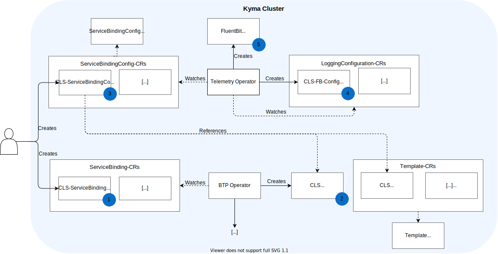

# Concept

Goal: Telemetry operator should be extended to a kind of automatic templating to be used in combination with the ServiceCatalog.


The original workflow for a user creating a ServiceBinding remains unchanged, which keeps the user workflow easier. There is no advantage of changing the user workflow. We also thought of changing the workflow to have a more automated setup, but this would require more knowledge of the user to actually perform the ServiceBinding with the automated FluentBit Configuration.
Instead, the workflow will be expanded by one additional step to create the FluentBit configuration for the corresponding ServiceBinding.

This concept covers the basic requirements with a minimal setup and reusing the Telemetry Operator for this purpose. At a later point, the Telemetry Operator could be split up to have a cleaner operator architecture, but this needs to be discussed further in the future.


## General Architecture / Workflow:

The following Workflow is explained in the context of the BTP Operator's ServiceBinding. The user can also refer to a Secret which is created by another instance or by the user. In this case, step one and two are skipped, and in step three the user refers to a custom Secret.

1. User creates ServiceBinding using CLI, BTP, or Busola.
2. BTP Operator watches ServiceBinding-CRs and creates corresponding Secret.
3. User creates Pipeline-CR and references to the Secret created by the BTP Operator. Furthermore, the user must specify which Preset should be used.
4. Telemetry Operator watches Pipeline-CRs. If a new CR is created, Telemetry Operator creates a new LoggingConfiguration-CR, using the Preset and the information given by the referenced Secret.
5. Telemetry operator creates new FluentBitConfig based on LoggingConfiguration-CR.



## Templating

To map the key-value pairs given by the referenced Secret, we need a CRD that maps the keys of the Secret to the corresponding FluentBit Output keys. Thus, the `Preset`-CRD is needed. This CRD is defined by:
- Name
- Mapping from Secret keys to FluentBit keys
- The filter and output plugins of FluentBit that are to be used
- Configuration of these filters and outputs

Kyma will then have predefined Preset-CRs, which the customer can use to create a FluentBit configuration based on the customer's created ServiceBinding. In this way, the users does not have to care about maintaining filters (i.e. `Lua` scripts), configuration of outputs (i.e. `http`-Plugin), etc.


## Secret Rotation

In this concept, the user refers to the Secret created by the BTP Operator, which is then mounted by the Telemetry Operator in the corresponding container. Therefore, the Secret rotation happens automatically by the general function of the Telemetry Operator.

> **NOTE:** The Secret rotation is not implemented in the Telemetry Operator until now (as of today; 15.10.2021).


# Extensibility for OpenTelemetry Collector Instances

The shown concept should be future-proof to be used for a controller or operator that manages OpenTelemetry Collector as well.
Even though a controller for the OpenTelemetry Collector is not part of Kyma yet, its CRD would have to meet the following requirement. This is necessary to separate the configuration's structure from specific settings that must be provided by Kubernetes Secrets.

## OpenTelemetry Collector CRD Requirements

In contrary to the FluentBit pipelines, where stages are connected by labels, the OpenTelemetry Collector configuration contains explicit pipeline descriptions.
These pipeline descriptions connect Receivers, Processors and Exporters.
This design does not allow to modify the configuration by appending raw snippets as the Telemetry Operator does for the LoggingConfiguration CRD.

It is a requirement for the future use of OpenTelemetry Collectors that the pipelines can be extended by the user.
In particular, this includes adding new Exporters to a predefined pipeline.
A future OpenTelemetry Collector API / CRD should allow inputs of Receivers, Processors and Exporters by the user.
The resulting service and pipeline definition is generated by the controller in the next step.
To fulfill the minimal requirement to adapt the templating mechanism for service consumption, this CRD is defined so that again, the user can paste the raw configuration section, which might reference Secrets.

The upstream [OpenTelemetry Operator](https://github.com/open-telemetry/opentelemetry-operator) only accepts complete Collector configurations and thus, does not allow to specify extensible pipelines.

## Unified Templating for Logging and OpenTelemetry

The OpenTelemetry Collector configuration should be a second sub-resource (besides the logging configuration) in the Preset.
This allows services to consume different types of telemetry. For example, an Elastic stack could consume both logs and traces.

## Example

A commercial provider might offer an ElasticSearch based service that can receive logs via the FluentD protocol and traces via the OpenTelemetry GRPC protocol. Kyma might contain a preset for this `ElasticService` that contains all necessary configurations.

```YAML
kind: Preset
apiVersion: telemetry.kyma-project.io/v1alpha1
metadata:
  name: ElasticService
spec:
  LoggingConfiguration:
    sections:
      - content: |
         [Output]
           ...
  TelemetryConfiguration:
    ...
```

The user creates a Kubernetes Secret with with his credentials and service endpoint. This can happen either manually or by creating a ServincBinding.

```YAML
apiVersion: v1
kind: Secret
metadata:
  name: my-elastic-credentials
  namespace: default
type: Opaque
data:
  ...
```

The user creates a `Pipeline` CR that indicates the usage of his Secret for the `ElasticService`

```YAML
kind: Pipeline
apiVersion: telemetry.kyma-project.io/v1alpha1
metadata:
  name: ElasticService
spec:
  presetRef: ElasticService
  secretRef:
    - name: my-elastic-credentials
      namespace: default
```

The Telemetry Operator generates the low-level CRs out of this pipeline

```YAML
kind: LoggingConfiguration
apiVersion: telemetry.kyma-project.io/v1alpha1
metadata:
  name: ElasticService-instanceXYZ
spec:
  sections:
    - content: |
        [Output]
           ...
      secretRefs:
        - name: my-elastic-credentials
          namespace: default

```

```YAML
kind: TelemetryConfiguration
apiVersion: telemetry.kyma-project.io/v1alpha1
metadata:
  name: ElasticService-instanceXYZ
spec:
  secretRefs:
    - name: my-elastic-credentials
      namespace: default
  ...
```

