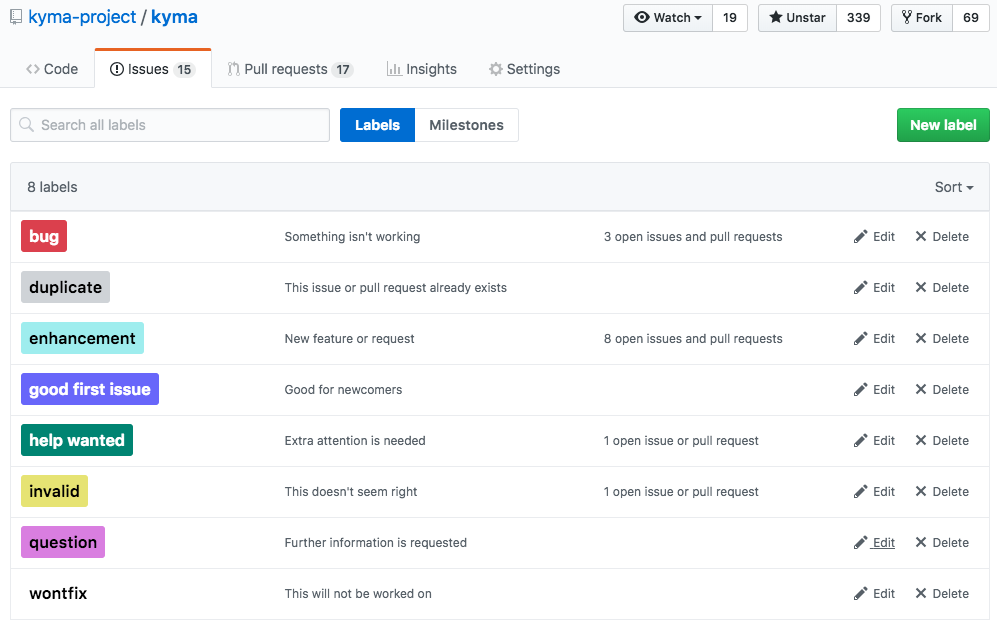
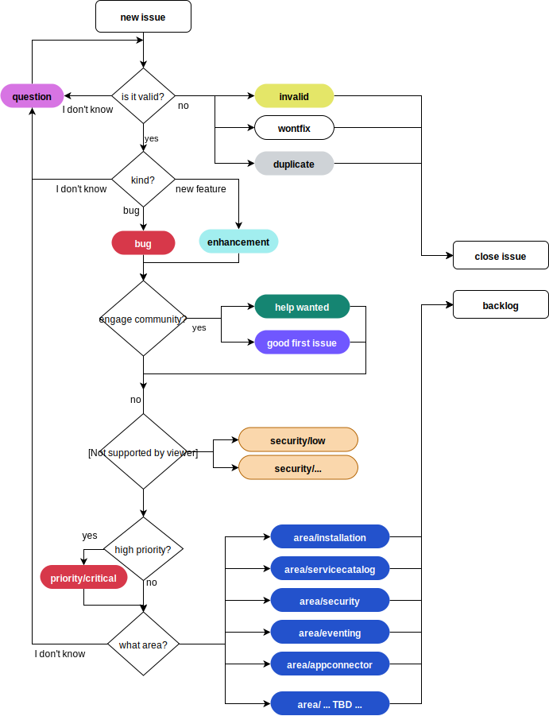

## Overview

In Kyma project we use GitHub Issues for tracking development process and [ZenHub](https://zenhub.com) to manage them on a team and sprint level and to have a clear overview of the work across all Kyma repositories. 

This document explains how the issues/pull requests workflow is organized in Kyma project:
- How issues triage is organized
- What tools are used in the workflow on what stage

## Used labels

Our statement is to:
* Use default labels provided by GitHub
* Introduce new labels only if it is really needed

### Default labels

### Custom labels

* `WIP` - to indicate that issue is already in progress,
* `critical` - to indicate the priority,
* `area/{CAPABILITY_NAME}` - to indicate what capabilities are related to a given issue. More then one `area` label can be assigned to a single issue

## Issues triage

Below flow diagram explains how issues triage is performed. 

There are different stages of the triage:

| Stage | Description | Labels |
|--------- |----------|---------|
| Validity | Asses the validity of the issue, if it can be taken for further triage and proper classification. | invalid, duplicate, wontfix, question |
| Kind | We need to know related issue is a new feature or maybe a bug.| enhancement, bug |
| Help | During triage we might identify issues that do not have high priority and could be taken by the community | help wanted, good first issue|
| Priority | Before issue is taken into backlog of a specific team and properly prioritized in a sprint, it must be clear in the general Kyma backlog which issues are most critical and should be taken as first | critical |
| Area | This labels clarify which capabilities are involved in a given issue. | area/{CAPABILITY_NAME} |

## Backlog

Kyma backlog contains issues that went through the triage, are not closed, and have labels added (except of labels `question`). Backlog prioritization is realized by assigning issues to Kyma milestones (ZenHub Release) and assigning critical label. Critical issues assigned to the current milestone have the highest priority.

>**NOTE** From the main Kyma backlog issues are taken by different teams that are responsible for specific areas of the Kyma. This is how we work on Kyma at the moment and this is why we started using GitHub milestone as an attribute to distinguish which team works on a specific issue. Thanks to this approach we can easily work in team sprints using ZenHub board. We are aware that our teams names are criptic for ya but unfortunately at the moment we were not able to come up with any better solution. If you have better ideas, please give us feedback. Sorry for the inconvenience. 

### Team sprints
Team Sprint is modeled as a GitHub milestone named with the following pattern: `{TEAM_NAME} Sprint {NUMBER}`. During the planing team selects issues from the backlog considering:
- priority (high priority first)
- area (default capability of the team first)
- dependencies (unblock others)

Developers mark issues with WIP label when they start work on it. When the work is done issue is closed.

### Team backlog (optional)
If the team wants to keep team backlog (assign issues they want to work on later) they can assign it to the Github milestone with no due date named with following pattern `{TEAM_NAME} backlog`

## ZenHub links

* Install the [ZenHub Chrome plugin](https://chrome.google.com/webstore/detail/zenhub-for-github/ogcgkffhplmphkaahpmffcafajaocjbd)
* Login to [ZenHub](https://www.zenhub.com/)
* Open the [Kyma ZenHub workspace](https://app.zenhub.com/workspace/o/kyma-project/kyma)
