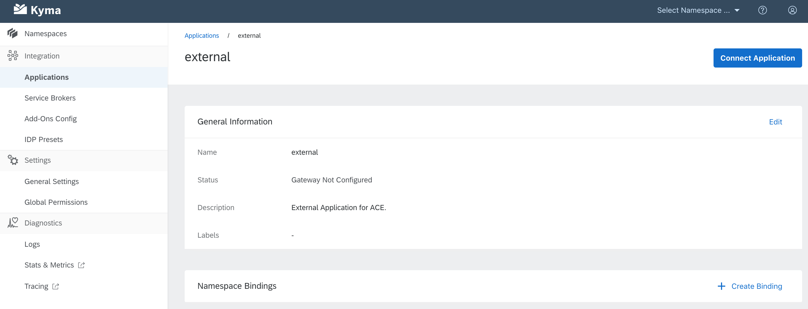

# Application Connector Extensions

The Application Connector allows management of the connected applications, their APIs and Event Catalogs. The Application Registry service exposes the REST API for doing it which is accessible from the external systems and requires pairing process which provides the client certificate used for authentication.

That approach works good for an external system but requires building an integration layer for connected systems. For making the developers live easier we need to introduce the possibility to manage APIs and Event Catalogs directly from the Kyma Console.

## Overview

The proposal is based on the following user story - user journey

- The administrator of the Kyma system is creating an Application using Application view in Kyma Console. New Application is ready and doesn't have any service classes registered.

- Administrator click `Add Service Class` (or a better name) which display the modal dialog for uploading Application Connector Extension with Service Class definition.
- The Service Class definition might be selected by the `Upload File` button or by drag and drop.
- After confirmation of the upload, the Service Class definition is loaded and added to the Service Class list.
- An administrator can view the Service Class definition
- An administrator can edit the Service Class definition and edit the following information: name, provider, credentials. It might be even possible to edit the whole Service Class definition.

## Application Connector Extension

The Application Connector Extension is the format of the definition which represents the Service Class or Classes.

There are several requirements for the ACE:

- It must be in the form of a single file containing everything.
- It can contain a single or multiple Service Classes
- It must be human readable - JSON format is preffered
- It must be compatible with the Swagger file and Application Registry payload. For the sake of usability, an administrator should be able to upload the Swagger file with the API definition or Async API with the events definition and the Application Connector will be able to generate the missing information and to register the service class which might be later edited with the missing informations, like credentials. The same with the App Registry payload, an Administrator can upload the payload prepared for the App Registry POST request and the Service Class will be registered.
- It must be ready for extension

The ACE will have the functionality similar to Google Chrome Extension: https://fileinfo.com/extension/crx
In the future, we might even create a registry of the ACE components.

## Technical assumptions

- The functionality for uploading Service Classes must be compatible with the Application Registry service API. If something is possible using the external API definition, then it must be also supported by ACE. The App Registry service might be reused and we can expose only internal API over GraphQL layer. It is completely up to the implementation.
- The functionality must be available for Kyma administrators - the details of the security must be defined. 

## Wireframes

- That is a placeholder for wireframes.

## Glossary

- Application Connector Extension ACE - definition of the Service Class containing the APIs and Event Catalogs in form of the JSON payload which might be consumed by the Application Connector.
- Service Class - entry in the Application representing API and/or Event Catalog

