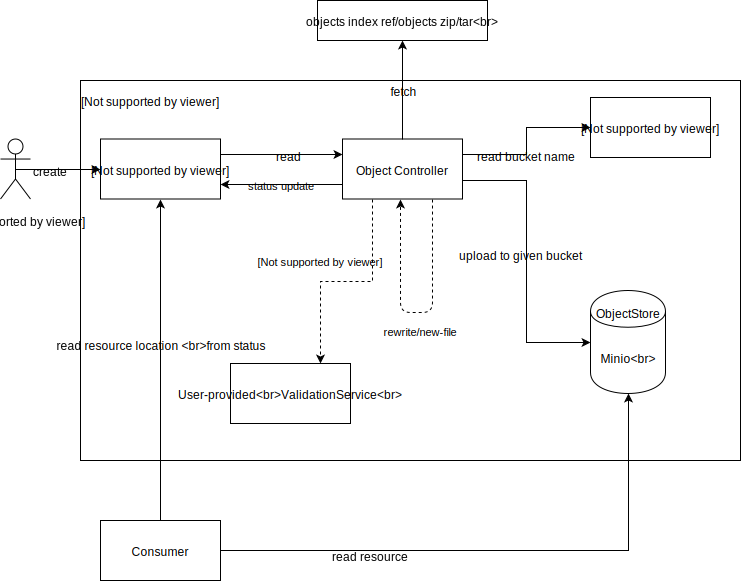
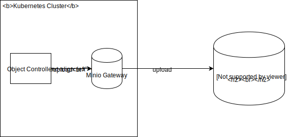

# Asset Store

Created on 2019-01-03 by Lukasz Gornicki (@derberg).

## Status

Proposed on 2019-01-04

## Motivation

1. Have a generic solution for storing in s3 like storage any kind of asset: zip file, markdown file, PNG or JS (JavaScript)
2. Have a storage solution not locked to one vendor, like AWS S3 only, or like to Minio on-premise only
3. Have a storage solution that not only stores the file but also exposes it directly to internet

## Use case

1. Storage for documentation and related images
2. Storege for API specifications
3. Storage for static client-side applications

## Solution

A new custom solution called Asset Store.



1. Location of the asset is specified in the Asset custom resource.
2. The controller checks status of referenced bucket to make sure it is ready and it makes sense to fetch the asset. If defined separately, controller creates new bucket with generated name for a given asset.
3. Asset controller fetches the asset basing on the information given in the custom resource.
4. The controller performs:
    - Validation of the asset by communicating with validation webhook specified in the custom resource
    - Mutation of the asset by communicating with mutation webhook specified in the custom resource
    - New file creation, if such file was referenced in the resource definition as a ConfigMap
  
   If any of above operations failed, controller updates the resource with `ready: False` status  
5. Controller uploads the asset to minio to a bucket that name is specified in the custom resource. 
You need a bucket to upload assets, you create it separately as a Bucket custom resource. It is also possible to define in Asset CR that you want to have new autogenerated bucket.
6. Controller updates the status of the Asset custom resource with information about location of the file

### Bucket custom resource

You might want to use different bucket per solution. This is why you need to be able to specify multiple buckets for different Assets. For example one bucket for documentation and one bucket per Web application.

Another use cases for having multiple Buckets configuration:
- Future extensibility by allowing bucket policy specification per solution
- Minio doesn't support setting a bucket to behave as a static website host. Future controller of the Bucket custom resource will have to handle this additional functionality
- Minio doesn't support setting a CDN for your asset. Future controller of the Bucket custom resource will have to handle this additional functionality. For example controller will be responsible for configuring a CloudFront for your bucket on S3

Example resource for first version of the Assets Store:
```
apiVersion: assetstore.kyma-project.io/v1alpha1
kind: Bucket
metadata:
  name: my-bucket
  namespace: default
spec:
  policy: public #or other policies
status:
  ready: False
  reason: BucketCreationFailure
  message: "service unavailable"
```

Lifecycle of the Bucket CR is done with the Bucket controller:
- Once CR is created the bucket with the CR name is created in the storage under `namespaces-{NAMESPACE_NAME}-{CR_NAME}`. Status of the CR contains reference URL to the created bucket
- Once CR is deleted the bucket with all the content in it is removed

#### Bucket reference

You reference the Bucket in your Asset CR with the following info in the spec:
```
  bucketRef:
    name: my-bucket
```
You can also request creation of new bucket with autogenerated name to not create a Bucket CR separately:
```
  bucketRef:
    createNew: true
```

It must be provided and the Asset controller checks the Bucket custom resource status to make sure the bucket exists:

- The deletion of the Bucket CR requires from the Asset controller to actively monitor the status of the referenced bucket. In case bucket is deleted, the status of the Asset CR is updated to `ready: False` and assets references are removed.
- Update of the reference causes recreation of the assets in new location, removal from old location and update of the status and the references

## Asset custom resource

Asset resource mandatory information is the:
- reference info about the source file/object/asset location that must be fetched by Asset controller with 3 different modes:
  - `single` - the link points directly to asset that needs to be fetched
  - `index` - the link to index.yaml file that contains reference to files that need to be separately fetch from a given relative location
  - `package` - the link to the zip/tar file that must be unziped before it is uploaded
```
#sample of index file with markdown and assets files
apiVersion: v1
files:
  - name: 01-overview.md
    metadata:
      title: MyOverview
      type: Overview
  - name: 02-details.md
    metadata:
      title: MyDetails
      type: Details
  - name: 03-installation.md
    metadata:
      title: MyInstallation
      type: Tutorial
  - name: assets/diagram.svg
```
- reference to the bucket where the asset should be stored
```
apiVersion: assetstore.kyma-project.io/v1alpha1
kind: Asset
metadata:
  name: my-package-assets
  namespace: default
spec:
  source:
    mode: single # or index or package
    url: https://some.domain.com/main.js
  bucketRef:
    name: my-bucket
```

The optional information is the:
- ConfigMap reference, that points to the ConfigMap that introduces [a new file](https://github.com/kyma-project/kyma/blob/master/resources/core/charts/service-catalog-addons/charts/instances-ui/templates/configmap.yaml) that is also sent to the bucket along with other files
- Asset validation webhook reference to a service that performs the validation of fetched assets before they are uploaded to the bucket. The use cases are:
  - validation of specific file against some specification
  - security validation
```
apiVersion: assetstore.kyma-project.io/v1alpha1
kind: Asset
metadata:
  name: my-direct-assets
  namespace: default
spec:
  source:
    direct: https://some.domain.com/my.json
    validationWebhookService:
        name: swagger-operations-svc
        namespace: default
        endpoint: "/validate"
    rewrites:
      - keyvalue: 
          basePath: /test/v2
  bucketRef:
    name: my-bucket
status:
  ready: False
  reason: Validation failure
  message: "file is not valid against provided json schema"
```
- Asset mutation webhook reference to a service that acts similar to the validation service mentioned above, but mutates the asset instead of just validating. The use case is for example the asset rewriting through `regex` operation or `keyvalue` (like for example modification in json specification)


## Asset Validation Webhook details

Asset Store must provide a flexible way of validating the asset before they are uploaded to the bucket. Different use cases bring different validation requirements. The best way is to do it by introducing a webhook that will receive an asset for validation and reply to the controller with defined status schema

1. Controller calls the `/validate` endpoint of the given service in a given namespace
```
validationWebhookService:
  name: swagger-operations-svc
  namespace: default
  metadata:
    pattern: \json|yaml
  endpoint: "/validate"
```
2. The service gets the following payload and by default must reply within 1sec:
```
{
    name: my-direct-assets
    namespace: default
    metadata:
      pattern: \json|yaml
    assets: {
      name1: "content",
      name2: "content"
    }
}
```
3. The controller:
   - times out after 1sec because of no response and updates the status of the Asset to False
   - gets response with successful or failing validation in the following for:
```
{
   status: {
     name1: {
       status: Failure,
       message: "much more details of the failure"
     },
     name2: {
       status: Success,
       message: "much more details"
     }
   }
}
```
4. If at least one asset failed the validation the status of the Asset is set to False and proper message about a given asset is added to the status. Otherwise the status is set to True and asset uplodaded to the bucket.


## Asset mutation webhook details

Asset Store must provide a flexible way of mutating the asset before they are uploaded to the bucket. Different use cases bring different mutation requirements. Like in case of validation it can be solved by webhook solution.

1. Controller calls the `/mutate` endpoint of the given service in a given namespace
```
mutationWebhookService:
  name: swagger-operations-svc
  namespace: default
  metadata:
    rewrite: keyvalue
    pattern: \json|yaml
    data: 
      basePath: /test/v2
  endpoint: "/mutate"
```
2. The service gets the following payload and by default must reply within 1sec:
```
{
    name: my-direct-assets
    namespace: default
    metadata:
      rewrite: keyvalue
      pattern: \json|yaml
      data: 
        basePath: /test/v2
    assets: {
      name1: "content",
      name2: "content"
    }
}
```
3. The controller:
   - times out after 1sec because of no response and updates the status of the Asset to False
   - gets response with mutated content:
```
{
   assets: {
     name1: "content",
     name2: "content"
   }
}
```
4. Controller updates the status that mutation is completed and uploads assets to the bucket

#### Optional mutation service

Asset Store comes with one out-of-the box mutating service that enables easy way of assets modification before it is uploaded to the bucket, through `regex` operation or `keyvalue`:
```
  name: assetstore-rewrite-svc
  namespace: kyma-system
  endpoint: /mutate
  metadata:
    #keyvalue example for use case of swagger file rewriting
    - rewrites:
        pattern: \json|yaml
        keyvalue: 
          basePath: /test/v2
    #regex example for documentation modification in the markdown       
    - rewrites:
        - regex: 
            find: \stitle="(.*)?"\s*(/>*)
            replace: $2<title>$1</title>          
```


## Minio local vs cluster modes

Mino as a storege supports Kyma's manifesto and the rule of `bateries included`. It makes development easier. Nevertheless for production usage Minio should be used in a [gateway mode](https://github.com/minio/minio/tree/master/docs/gateway). Gateway mode gives you a flexibility of using asset storage from any major cloud provider like Google/Amazon/Microsoft without modifications in the Asset controller as it talks to the Minio/Minio Gateway with the same S3 API



