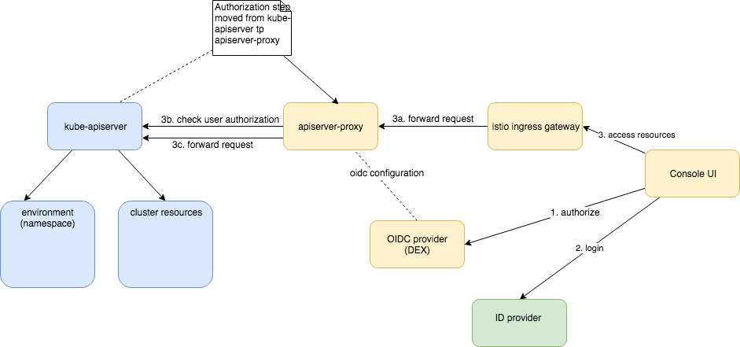

# Authorization proxy

## Abstract

It is not possible to install kyma project on managed clusters like Google Kubernetes Engine (GKE) or Azure Kubernetes Service (AKS). To enable kyma-project adoption it has to run on any infrastructure supporting Kubernetes. Kyma requires access to kube-apiserver configuration and uses some kubernetes alpha features, that is **not allowed** in many managed clusters. Even if some providers allow for such configuration, it has to happen during cluster provisioning, what makes kyma installation process more complex.

## Problems to solve

1. The kube-apiserver component must be configured to verify tokens coming from an external OIDC provider (coming with Kyma). Usually, it is done during the installation by providing additional parameters such as **oidc-issuer-url**, **oidc-client-id**, **oidc-username-claim**, to name a few. These parameters cannot be set in GKE or AKS.
2. Kyma depends on some alpha features of Kubernetes that are not supported by the managed clusters, for example PodPreset from `settings.k8s.io/v1alpha1`.

## Proposal

> Read [this](https://github.com/kyma-project/kyma/blob/master/docs/authorization-and-authentication/docs/003-architecture.md) document first to understand the current authorization concept.

The idea is to move the responsibility for authorization from kube-apiserver to apiserver-proxy. If the apiserver-proxy verifies user permissions, it is not required to configure OpenID Connect tokens in the kube-apiserver. The proxy can use a service account to communicate with the apiserver. The request flow would be as follows:
- The proxy validates JWT passed in the Authorization Bearer header.
- The proxy extracts user and groups from JWT and the target resource from request path and method to construct attributes record. That record is send to kubernetes authorization API .
- If the authorization fails, the request is finished with the `403` response.
- If the authorization succeeds, the request is forwarded to the kube-apiserver.

The proxy implementation can be based on [this](https://github.com/brancz/kube-rbac-proxy) project.
