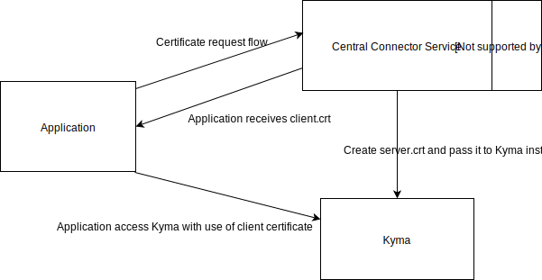
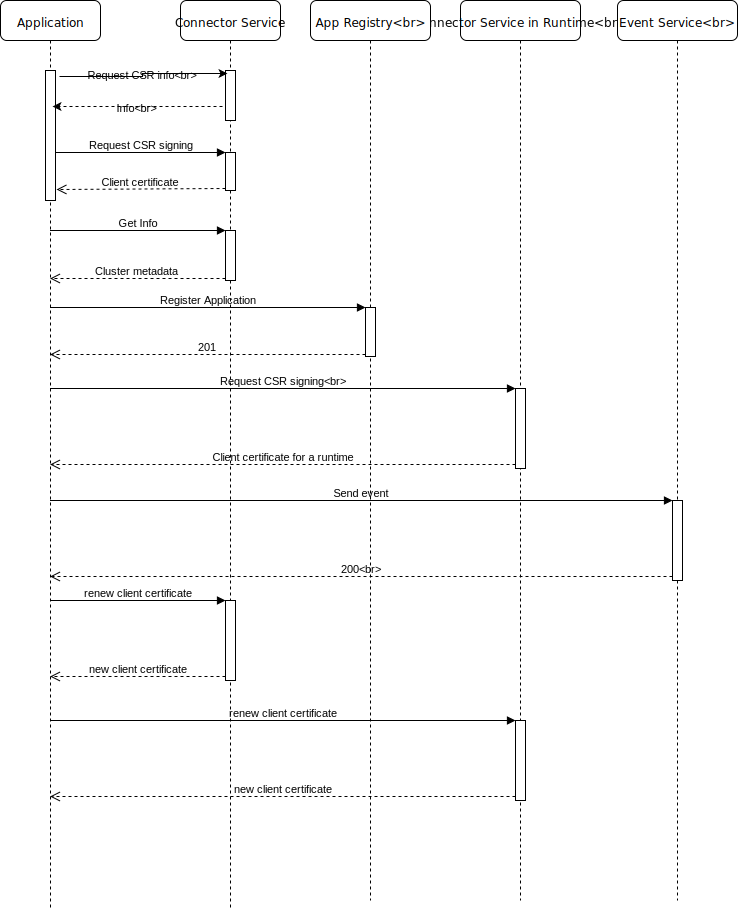
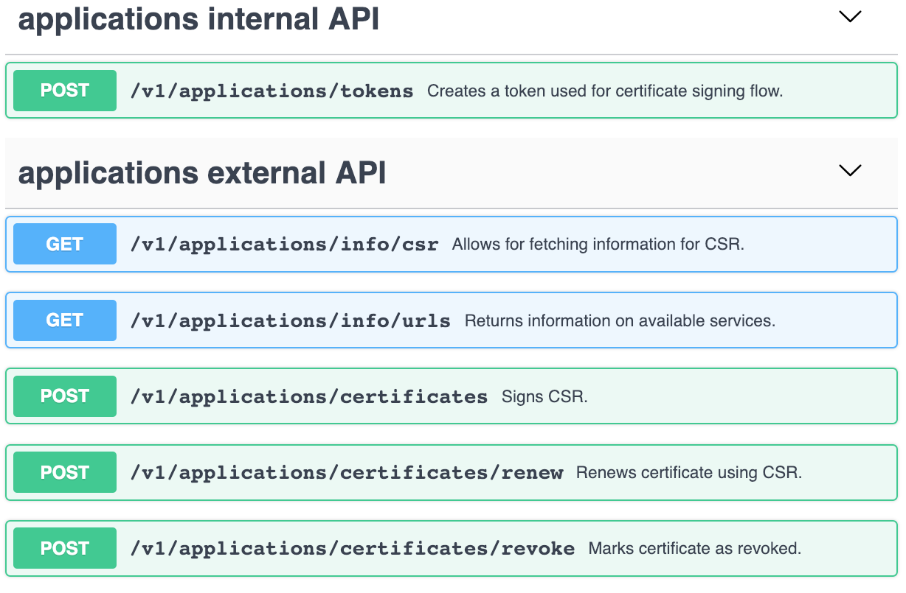
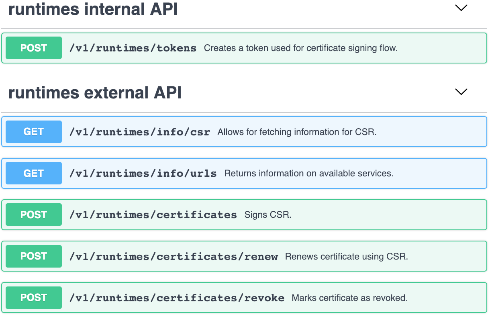
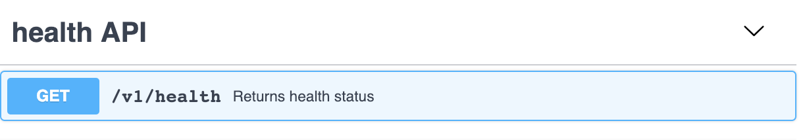

# Central Connector Service

Created on 2018-12-17 by Lukasz Szymik (@lszymik).

## Status

Proposed on 2018-12-17.

## Motivation

The Connector service is responsible for establishing a secure connection between the connected external solutions and Kyma cluster. Such a connection is achieved by providing the client certificate to the connected solution. This certificate is later validated by the Application Connector. The client certificate is used for registering application metadata, such as APIs, and sending events to Kyma.
Currently, the connection between an external solution and Kyma is always point-to-point. 

As the customers work with multiple Kyma clusters, they will benefit from extending the provisioning of Kyma client certificates. A central Connector Service would manage the provisioning of certificates for multiple Kyma clusters and connected clients. Such approach allows the users to control their entire Kyma ecosystem from a single, central point.


## Goal

1. The Connector service handles client certificate provisioning for the connection with the Application Registry.
2. The Connector service handles client certificate provisioning for the connection with the Event Service.
3. The Connector service handles certificate provisioning for Kyma cluster.
4. The Connector service handles certificate rotation.
5. The Connector service returns information about the available cluster endpoints.


## Suggested solution

The Connector Service (CS) is deployed as a central component.

  - The CS is deployed as a global component in implementations with multiple Kyma clusters where one cluster takes the role of a master.
  - The CS exposes a secured connection for requesting client certificates signed with root CA.
  - The CS exposes a secured connection for requesting server certificates signed with root CA and deployed to Kyma cluster.
  - The client certificate enables a trusted connection with the central Kyma cluster where the App Registry is stored.
  - The client certificate enables a trusted connection with the Kyma cluster where the server certificate is delivered.
  - The server certificate enables a trusted connection with central Kyma cluster.
  - For standalone Kyma clusters, the Connector Service is deployed locally and works in the same manner.


### Component Diagram



### Connection Flow Diagram



#### Connection Flow overview

1. The application requests the client certificate from the central Connector Service. The flow is a standard one-time token flow currently used in Kyma. 

   The client certificate has the following properties:

   - Is signed by the root CA
   - The subject of the client certificate contains the unique ID of the Application and information about the group to which the Application is assigned

2. After the cluster is provisioned, it requests for the Kyma cluster client certificate. As a response, it receives a certificate chain consisting of the generated Kyma cluster client certificate and the root CA certificate. The client certificate has the following properties:

   - Is signed by the root CA.
   - Contains the information about the cluster name for which it is generated.

3. The Application can access the master Kyma cluster and the Kyma cluster using the single certificate. The identity of the Application and the Kyma clusters is encoded in the certificate subject. It allows the verification of the calling parties.

### Cluster information

The Connector Service exposes the `info` endpoint which returns information about the connected clusters, including the App Registry URL, URL to the Event Service working in the cluster, etc.
A connected Application calls this endpoint periodically and checks the cluster status. 

### Certificate revocation 

The client certificates and Kyma cluster client certificates must be revoked as soon as they are compromised. The list of revoked certificates will be stored in the central Connector Service and synchronized with all Kyma clusters. The list will contain both the client certificates and the certificates in Kyma cluster.

The fingerprint of the compromised certificate will be added to the Application Connector. It will ensure that the connected Application which uses the compromised certificates can no longer perform any calls.

>**NOTE:** The current versions of Istio and the Nginx-controller do not support the revocation list. The further plan to add support for this feature will be provided later.

## Proof of Concept

### Prerequisites:

- Private key (`rootCA.key`) and certificate (`rootCA.crt`) generated as a root CA
- Kyma cluster provisioned with `rootCA.key` and `rootCA.crt` as a CA
- Application `test-application` created

### Steps

1. Generate the client certificate (`client.crt`) for the `test-application` using the Connector Service.
2. Access the cluster using the generated `client.crt`

    ```
    curl  https://gateway.{CLUSTER_DOMAIN}/test-application/v1/metadata/services --cert client.crt --key client.key
    ```

3. Generate the Kyma cluster client CA signed with the root CA

    ```
    openssl genrsa -out client.key 4096
    openssl req -new -out client.csr -key client.key -subj /CN="name"
    openssl x509 -req -sha256 -in client.csr -out client.crt -CAkey rootCA.key -CA rootCA.crt -days 1800 -CAcreateserial -CAserial serial
    ```

4.  Create the certificate chain containing `rootCA.crt` and `client.crt`.

    ```
    cat rootCA.crt client.crt > client-chain.crt
    ```

5. Edit the secret containing CA `nginx-auth-ca` to use `client-chain.crt` as `ca.crt` and `client.key` as `ca.key`.

    ```
    export CERT=$(cat client-chain.crt | base64)
    export KEY=$(cat client.key | base64)
    cat <<EOF | kubectl apply -f -
    apiVersion: v1
    data:
      ca.crt: $CERT
      ca.key: $KEY
    kind: Secret
    metadata:
      name: nginx-auth-ca
      namespace: kyma-integration
    type: Opaque
    EOF
    kubectl -n kyma-system delete po -l "app=nginx-ingress"
    ```

6. Wait for the Pod to restart. Access the cluster using the previously generated `client.crt`:

    ```
    curl  https://gateway.{CLUSTER_DOMAIN}/test-application/v1/metadata/services --cert client.crt --key client.key
    ```

7. Revert changes by setting the root CA-signed certificate as the original one and call the cluster using of the Kyma cluster client certificate as the client certificate.

## API design

### Use cases

Connector Service needs to support the following operations:

- Certificate generation.
- Service discovery (getting urls of exposed Application Connector services).
- Certificate renewal.
- Certificate revokation.

### Certificate generation

Requirements:

- Certificate generation flow must be backward compatible,however, resource names may change.
- There should be separate endpoints for applications and XF Runtimes.

### Getting urls

Requirements:

- Application should be able to get the following urls:
  - API Registry Service URL.
  - Events Service  URL.
  - Certificate renewal URL.
  - Certificate revocation URL.
  - Runtime URL.
- XF Runtime should be able to get the following urls:
  - API Registry Service URL.  
  - Certificate renewal URL.
  - Certificate revocation URL.

### Certificate renewal

There are the following cases:

- Application certificate is about to expire.
- XF runtime client certificate is about to expire.
- CA root certificate is about to expire.

#### Application and XF runtime certificate renewal

Application and XF Runtime will implement cron job which periodically renews a certificate (previously issued and valid certificate will be used for authentication).

Requirements:

- There should be a separate endpoint for renewing Application and XF Runtime certificates.

#### CA root rotation

The concept of rotating CA root certificates is not prepared yet and don't have impact on API for Application and XF Runtime certificate renewal.

### Certificate revocation

Requirements:

- There should be a separate endpoint for revoking Application and XF Runtime certificates.
- For Q1 we don't need to propagate revocation information to XF Runtimes. In the first step we must not allow to renew a certificate which has been revoked.

## API proposal

The following assumptions were taken:

- API for Application and XF Runtime is symmetric.
- Group and Tenant name is passed in headers.
- Application ID is not needed in paths.
- Resource names can be changed to ensure consistent naming.
- Payloads returned in certificate generation flow cannot change.

The connector service exposes the following groups of endpoits:

- Health API.
- Internal API for Application (token generation and certificate revocation).
- Internal API for XF Runtime (token generation and certificate revocation).
- External API for handling certificate generation, renewal and service discovery for Applications.
- External API for handling certificate generation, renewal and service discovery for Runtimes.

The full api definition is [here](./assets/connector-service-api.yaml).

### APIs for Applications

The following API has been defined:



Certificate generation flow is handled by `v1/applications/token`, `v1/applications/signingRequests/info` and `v1/applications/certificates` endpoints. The operation flow and payloads have not been changed so backward compatibility is assured.

Service discovery is handled by `v1/applications/management/info`. The exemplary output:

```json
{
  "urls": {
  	"metadataUrl": "gateway.test.cluster.kyma.cx/{APP_NAME}/v1/metadata/services",
  	"eventsUrl": "gateway.test.cluster.kyma.cx/{APP_NAME}/v1/events",
  	"renewCertUrl": "connector-service.test.cluster.kyma.cx/v1/applications/certificates/renewals",
  	"revokeCertUrl": "connector-service.test.cluster.kyma.cx/v1/applications/certificates/revocations",
  	"runtimeUrl": "test.cluster.kyma.cx/"
  }
}
```

Certificate renewal and revocation is handled by `v1/applications/certificates/renewals` and `v1/applications/certificates/revocations` respectively. It was assumed that Application ID will be obtained from the certificate used for accessing the endpoints, however, it needs to by confirmed if it is technically feaseable with Nginx Ingress and Golang.

### APIs for Runtimes

The following API has been defined:



It is symmetrical to the API for Applications. The only difference is the structure of the output returned from `v1/runtimes/management/info`. The examplary output:

```json
{
  "urls":{
  	"metadataUrl": "gateway.test.cluster.kyma.cx/{APP_NAME}/v1/metadata/services",
  	"renewCertUrl": "connector-service.central.cluster.kyma.cx/v1/applications/certificates/renewals",
  	"revokeCertUrl": "connector-service.central.cluster.kyma.cx/v1/applications/certificates/revocations"
  }
}
```

### Health API

The following API has been defined:



### Returning API spec from the service

The user should be able to get specification from the service. There should be `v1/api.yaml` endpoint for this purpose.

### Open questions

The following questions should be answered:

- Should we expose full API in case Connector Service is deployed on standalone Kyma instance? In the other words  should Runtimes API be available in such a case?
- Is it possible to extract Application ID from certificate used for accessing `v1/applications/certificates/renew` endpoint?