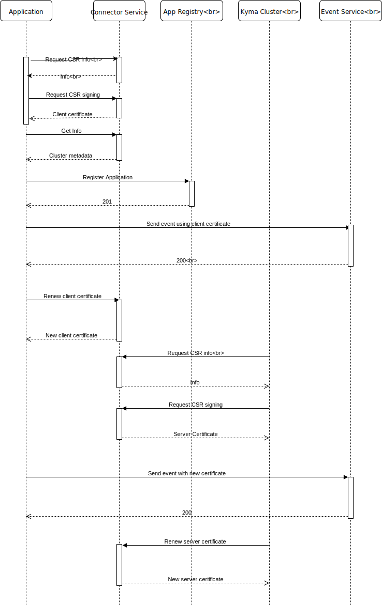

# Connector service with two phase pairing

Created on 2018-12-17 by Lukasz Szymik (@lszymik).

## Status

Proposed on 2018-12-17.

## Motivation

The Connector service is responsible for establishing a secure connection between connected applications and Kyma runtime. It is achieved by providing the client certificate which is later validated by the Application Connector.
A client certificate is used for registering application metadata, like APIs, and sending events to Kyma.


Currently, it is always a point to point connection. Customers have multiple Kyma clusters. The provisioning of Kyma client certificates can be extended. The central Connector Service might manage the provisioning of certificates for multiple Kyma clusters and connected clients.
Users will have a single point giving control over the whole Kyma ecosystem.

The central Connector service will also allow developing of the central Application Registry. The central App Registry can be used in a similar manner, overarching multiple Kyma clusters, and its connected applications.


## Goal

1. The Connector service handles client certificate provisioning for an App Registry connection.
1. The Connector service handles client certificate provisioning for an Event service connection.
1. The Connector service handles provisioning certificates for Kyma runtime.
1. The Connector service handles certificate rotation.


## Suggested solution

The Connector service (CS) is deployed as a central component:

  - CS is deployed as a global component in case someone is using multiple Kuma clusters and one of them is kind of central one.
  - CS is exposing a secured connection for requesting client certificates which are signed with root CA.
  - CS is exposing a secured connection for requesting server certificates which are signed with root CA and deployed into Kyma runtime.
  - The client certificate allows a trusted connection to the central Kyma cluster where App Registry is stored.
  - The client certificate allows a trusted connection to the Kyma runtime where the server certificate is delivered.
  - The server certificate allows a trusted connection to central Kyma cluster.
  - In the case of standalone Kyma cluster, the Connector service is deployed locally and works in the same manner.


### Component Diagram


### Flow Diagram



#### Connection Flow overview

1. The application requests the client certificate from the central Connector Service. The flow is a standard one-time token flow currently used in Kyma. 
   
   Client certificate has the following properties:
       
   - A client certificate is signed by the root CA
   - A subject of the client certificate contains info of Application unique id and the group to which the Application has been assigned to.
   
2. After the runtime is provisioned it request the intermediate certificate. As a response, it receives a certificate chain consisting of generated intermediate cert and the root CA certificate. An intermediate certificate has the following properties:
   
   - A certificate is signed by the root CA.
   - A certificate contains the information about the runtime name.
   
3. An application can access the Central Kyma and the Kyma Runtime using the single certificate. The Application and Kyma clusters identity are encoded in the certificate subject. It allows verification of the calling parties.
   

### Certificate revocation 


  
   
   
## Proof of Concept


### Prerequsits:

- Private key (`rootCA.key`) and certificate (`rootCA.crt`) generated as a root CA
- Kyma cluster provisioned with `rootCA.key` and `rootCA.crt` as a CA
- Application `test-application` created

### Steps

1. Generate client (`client.crt`) certificate for `test-application` using Connector Service.
1. Access the cluster using the generated `client.crt`
    
    ```
    curl  https://gateway.{CLUSTER_DOMAIN}/test-application/v1/metadata/services --cert client.crt --key client.key
    ```
    
1. Generate intermediate CA singed with the root CA
    
    ```
    openssl genrsa -out intermediate.key 4096
    openssl req -new -out intermediate.csr -key intermediate.key -subj /CN="intermediate"
    openssl x509 -req -sha256 -in intermediate.csr -out intermediate.crt -CAkey rootCA.key -CA rootCA.crt -days 1800 -CAcreateserial -CAserial serial
    ```
    
1.  Create certificate chain containing `rootCA.crt` and `intermediate.crt`.
    
    ```
    cat rootCA.crt intermediate.crt > intermediate-chain.crt
    ```
    
1. Edit secret containing CA `nginx-auth-ca` to use `intermediate-chain.crt` as `ca.crt` and `intermediate.key` as `ca.key`.
    
    ```
    export CERT=$(cat intermediate-chain.crt | base64)
    export KEY=$(cat intermediate.key | base64)

    cat <<EOF | kubectl apply -f -
    apiVersion: v1
    data:
      ca.crt: $CERT
      ca.key: $KEY
    kind: Secret
    metadata:
      name: nginx-auth-ca
      namespace: kyma-integration
    type: Opaque
    EOF

    kubectl -n kyma-system delete po -l "app=nginx-ingress"
    ```
    
1. Wait for a pod to restart and then access the cluster using previously generated `client.crt`
    
    ```
    curl  https://gateway.{CLUSTER_DOMAIN}/test-application/v1/metadata/services --cert client.crt --key client.key
    ```

1. Revert changes (ca root as orignal one) and do the call to cluster with use of intermediate certificate as a client one.