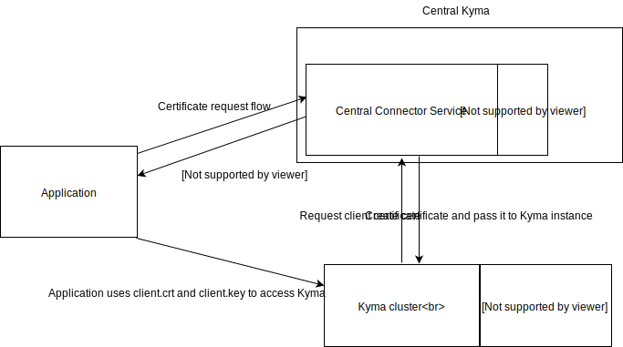

# Connector service with two phase pairing

Created on 2018-12-17 by Lukasz Szymik (@lszymik).

## Status

Proposed on 2018-12-17.

## Motivation

The Connector service is responsible for establishing a secure connection between connected applications and Kyma runtime. It is achieved by providing the client certificate which is later validated by the Application Connector.
A client certificate is used for registering application metadata, like APIs, and sending events to Kyma.

Currently, it is always a point to point connection. Customers have multiple Kyma clusters. The provisioning of Kyma client certificates can be extended. The central Connector Service might manage provisioning of certificates for multiple Kyma clusters and connected clients.
Users will have a single point giving control over the whole Kyma ecosystem.

The central Connector service will also allow developing of the central Application Registry. The central App Registry can be used in similar manner, overarching multiple Kyma clusters and its connected applications.

## Goal

1. The Connector service handles client certificate provisioning for an App Registry connection.
1. The Connector service handles client certificate provisioning for an Event service connection.
1. The Connector service handles provisioning certificates for Kyma runtime.
1. The Connector service handles certificate rotation.

## Suggested solution

The Connector service (CS) is deployed as a central components:

  - CS is deployed as a global component in case someone is using multiple Kuma clusters and one of them is kind of central one.
  - CS is exposing a secured connection for requesting client certificates which are signed with root CA.
  - CS is exposing a secured connection for requesting server certificates which are signed with root CA and deployed into Kyma runtime.
  - The client certificate allows trusted connection to the central Kyma cluster where App Registry is stored.
  - The client certificate allows trusted connection to the Kyma runtime where server certificate is delivered.
  - The server certificate allows trusted connection to central Kyma cluster.

### Component Diagram

### Flow Diagram

#### Application is requesting client certificate

1. An application is requesting CSR information by sending registration token.
2. Information about CSR requirement and URL for signing it is returned.
3. CSR is created and send for a signing.
4. The client certificate is returned with information about App Registry endpoint and Info endpoint.

**Security:** The security is based on one-time tokens.

#### Application is registering metadata

1. An application is registering all APIs and Event catalogs in App Registry. It might be a single call or multiple separated calls.
2. An application is able to update registered metadata.

**Security:** The client certificate is representing the connected application.

#### Application is getting Kyma metadata

1. An application calls info endpoint.
2. The information about Kyma runtime is returned. The information contains: App Registry URL, Event service URL, Connector service in Runtime (with connection token.)
3. An application is updating its configuration if something changed (e.g., new Event Service URL, the certificate is expiring, and a new one must be fetched.)
4. The calls should be executed periodically (pulling). It will be used as a heartbeat from the connected application.

**Security:** The client certificate is representing the connected application.

#### Application is connecting to the Kyma runtime

1. An application can access Kyma runtime using the client certificate generated by the central Connector Service.
2. Runtime validates the certificate as well as tenant and runtime inforamtions stored in Subject

**Security:** The client certificate is representing the connected application.

#### Application is sending events to Kyma

1. The call to Event service with a second client certificate.

**Security:** The client certificate from phase two is representing the connected application.

#### Application is requesting client certificate renewal

1. The application is sending a new CSR
2. Connector service is returning a signed client certificate

**Security:** The connector service is returning new certificate based on an already valid one. If certificate already expired then pairing process need to be started again.

### Additional improvements and comments

#### Store additional metadata for application

- The application custom resource might be extended with additional metadata like a tenant, application group, etc.
- The metadata will be used for a better description of the connected application.
- The additional metadata can be provided with default values injected during runtime deployment.

#### Kyma as a standalone cluster

- The connector service might work with two phases approach on a single Kyma cluster.
- The info endpoint will return the same addresses.
- The same connector service will provide both client certificates.
- The configuration flag might control it.