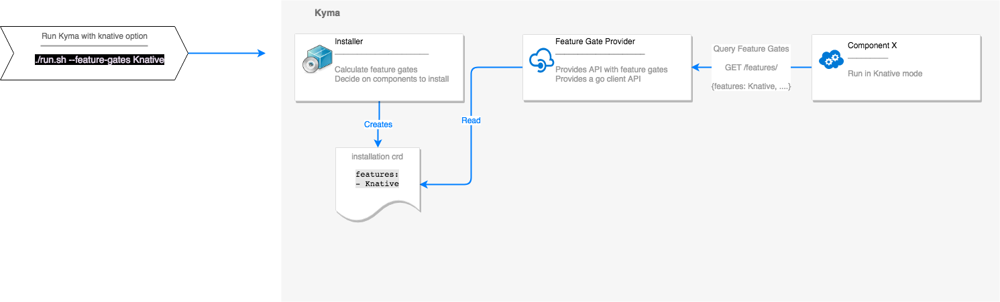

# Feature Provider Proposal

## Overview

Currently the only way to have a feature toggle is via Helm charts. This is
usually done via providing a value in the values file, a condition in the
template and/or setting an env var or a cmd arg for the app. This proposal
provides an alternative method of feature providing.

## Sample Use Case

To better explain the differences, the following use case will be referenced.

### Use Case 1: Kyma on Knative

The goal is to have Kyma running on top of knative with Kyma components
leveraging knative features (serve, build and eventing). The transition will be
gradual such that Kyma can run in two modes, legacy mode (i.e without Knative)
and Knative mode. In such mode any component in Kyma can behave as following:

||Mode: Legacy| Mode: Knative|
|-|-----------|--------------|
|Legacy-only Component| Installed: Yes | Installed: No (component is totally replaced with Knative functionality)|
|Dual Mode Component: Unchanged| Component is installed | Component is unaffected with Knative functionality|
|Dual Mode Component: Modified| Component is installed | Component changes its behavior to work in this mode and needs to be aware it's running in this mode|
|Knative-only Component| Installed: No| This component is only installed in Knative mode|

#### Requirements

* To incorporate knative support as an alpha feature.
* Can start Kyma in legacy mode or knative mode.
* Can upgrade an old cluster to the new version without enabling the knative
  mode.

## Current Solution

This is how to implement the knative use case currently

## Proposed Solution

This proposal is to introduce a the feature gates concept in a similar semantic
to [Kubernetes feature gates.](https://kubernetes.io/docs/reference/command-line-tools-reference/feature-gates/)

Feature gates are a set of key=value pairs that describe alpha or experimental
features. An administrator can on each turn a feature on or off on each
component.

### Feature Stages

A feature can be in Alpha, Beta or GA stage. An Alpha feature means:

* Disabled by default.
* Might be buggy. Enabling the feature may expose bugs.
* Support for feature may be dropped at any time without notice.
* Feature can change in incompatible ways in a later software release without
  notice.
* Recommended for use only in short-lived testing clusters, due to increased
  risk of bugs and lack of long-term support.

A Beta feature means:

* Enabled by default.
* The feature is well tested. Enabling the feature is considered safe.
* Support for the overall feature will not be dropped, though details may
  change.
* The schema, APIs and/or semantics may change in incompatible ways in a
  subsequent beta or stable release. When this happens, we will provide
  instructions for migrating to the next version.
* Recommended for only non-business-critical uses because of potential for
  incompatible changes in subsequent releases.

A GA feature is also referred to as a stable feature. It means:

* The corresponding feature gate is no longer needed.
* Stable versions of features will appear in released software for many subsequent versions.

### Feature Gate Provider

A feature gate provider is responsible of :

* Providing an easy API for feature gates, namespaced feature gates, conditional
  feature gates..etc.
* Persisting the current state of feature gates.
* Provides an easy go client library to be used by components.

Example: [Feature flags API](https://github.com/AntoineAugusti/feature-flags)

### Use Case Sample Implementation

