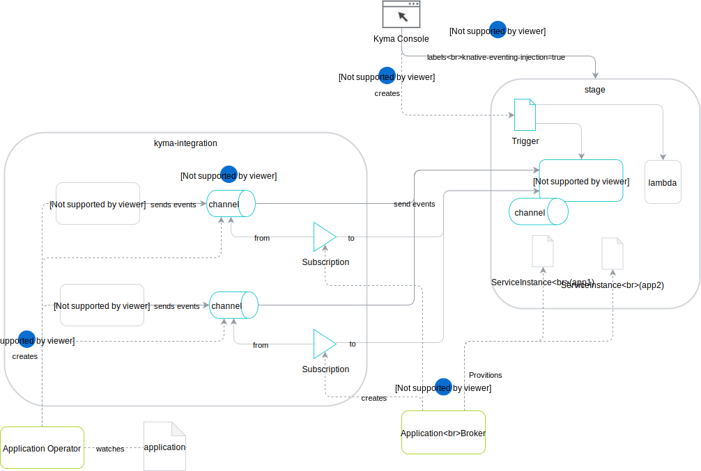
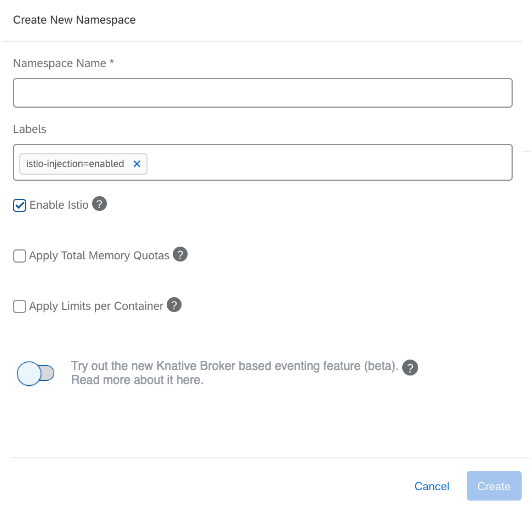

# Integration of the Knative-based function controller

## Introduction

As of 0.5, Knative Eventing defines [`Broker` and `Trigger`](https://knative.dev/docs/eventing/broker-trigger/) objects as higher-level abstractions that allow brokering events based on some event filtering criteria.

This is a proposal of how to introduce these objects in Kyma as an alternative to using the existing Kyma Event Bus. It describes how to build namespace scoped eventing mesh with fault domain isolation and access control. The proposal describes two possible solutions, the migration path and tries to highlight and address the challenges and open questions of using them.

## Features

### Current Features

- As a developer, I want to publish events to Kyma from outside the cluster.
- As a developer, I want to publish events to Kyma from inside the cluster.
- As a developer, I want to subscribe to events in Kyma from a specific source with a specific event-type.
- As an admin, I want to enable or disable events in a specific namespace.

### New features

- As an admin, I want to configure the default cluster wide Knative `Channel` kind to be used. 
- As an admin, I want to configure a Knative `Channel` kind to be used by default for events per namespace that overrides the cluster default configuration.

## Proposed solution

There are two proposed solutions. Solution 1 is an instant transition and deprecation proposal where the new `Broker` based eventing will replace the existing Event Bus. The Kyma `Susbscription` and `EventActivation` CRDs will be removed and Event Bus users will need to migrate to the new knative CRDs.

Solution 2 is about having both systems coexisting for one or two releases, during which the namespaces with the `knative-eventing-injection=enabled` label will have the new `Broker` based eventing, while the ones that don't will just have the same old Kyma Event Bus based behavior (i.e uses Kyma `EventActivation` and `Subscription` CRDs) in order to:

1. Allow Kyma users to try the new Knative `Broker` based eventing.
2. Keep current users of Event Bus CRDs unaffected and allow a smoother migration path.
3. Ease our migration and upgrade pain by giving users a Kyma release where they can migrate their lambdas themselves and understand how it behaves.

### Solution 1: Knative Brokers Only

#### Overview

The usage of Knative Eventing shifts the eventing paradigm in Kyma, from a single messaging Pub/Sub system, to an eventing mesh with isolated fault domains, access control and dynamic event routing where many senders inject events into the mesh from multiple source points, and many sinks (i.e subscribers) receive all or a subset of those events based on filters and access control. The responsiblity of Kyma system is to correctly and dynamically wire the eventing mesh to match the user eventing needs and achieve optimum event routing.

Solution 1 describes how Kyma system will build and wire the eventing mesh to achieve proper event routing from external application to the subscribers such as the lambda functions.

#### Architecture

For every namespace that is allowed to receive events, there is a default `Broker` in the namespace. Kyma will do all the wiring from the `Event Service` to the local namespace `Brokers` and subscribers who want to receive events, should create a Knative `Trigger` against their local default `Broker`.

1. For every new `Application` the `Application Operator` creates an `Event Service` and its corresponding  `Knative Channel` that will be used to fanout events to all allowed brokers.
2. For every new namespace, Kyma Console ensures it has the label `knative-eventing-injection=enabled` so that a default `Broker` gets created by the Knative Eventing controller.
3. Once the `Application Broker` gets a provision request for a `Service Instance` which has `bindable` parameter set to `false`, it will create a `Knative Subscription` that has:
   - The channel pointing to the relevant `Event Service` fanout `Channel`
   - The subscriber pointing to the default `Broker` of the namespace
   - The ownerRef set as the `Service Instance` that just got provisioned which ensures the subscription gets deleted by Kubernetes garbage collector when the `Service Instance` gets deprovisioned.
4. `Kyma Console` creates the proper `Trigger` objects for the `Lambda` function for every event type chosen as a lambda trigger.
5. Events received by `Event Service` will be delivered to its channel which in turn will do a fanout to all connected brokers which will finally deliverd it to the lambda functions.

### Solution 2: Coexisting

<!-- markdownlint-disable MD024 -->
#### Overview

To offer Kyma Event Bus users (whether the UI or CRD users) a smoother transition and to better manage their expectations, it is possible to roll out the new feature of using `Knative Broker` a new `Beta` feature that the user can choose per namespaces to opt-in (referenced here as `opted-in namespaces`). Other namespaces (referenced here as `legacy namespaces`) would be using the old Event Bus.

#### Architecture

1. For every new `Application` the `Application Operator` creates an `Event Service` and its corresponding  `Knative Channel` that will be used to fanout events to the opted-in namespaces.
2. From Kyma Console UI, when the user creates a namespace, the pop up will show an info message and toggle that looks like this:

and by enabling the toggle, Kyma Console ensures it has the label `knative-eventing-injection=enabled` so that a default `Broker` gets created by the Knative Eventing controller.
3. Once the `Application Broker` gets a provision request for a `Service Instance` which has `bindable` parameter set to `false`, it creates a `Knative Subscription` for `opted-in` namespaces (as in solution 1) or an `EventActivation` for `legacy namespaces`.
4. `Kyma Console` creates the appropriate `Trigger` or `Kyma Subscription` objects for the `Lambda` function for `opted-in` and `legacy` namespaces.
5. Publishing events from `Publish` will deliver events to subscribers in both `opted-in` and `legacy` namespaces.

## Challenges

TBD

### Migration and backward compatability

TBD

## Next Steps

TBD

## Open Issues

TBD
