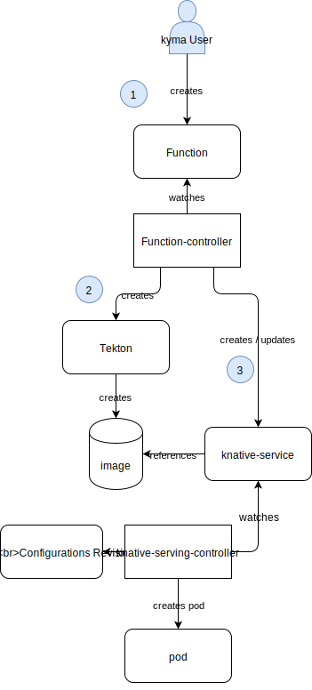
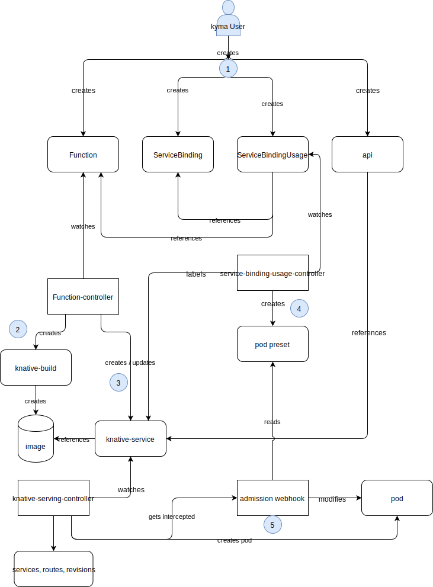

# Integration of the Knative-based function controller

## Introduction

One of the main features of Kyma is its ability to run serverless functions. Currently, the open-source project [Kubeless](https://github.com/kubeless/kubeless) is the functions provider in Kyma. However, the focus shift towards Knative assumes replacing Kubeless with a functions runtime controller (function-controller). This function controller provides [Knative](https://github.com/knative)-based functions (knative-functions).

The migration to a new functions provider should ensure a similar user experience as the currently available Kubeless runtime does. This includes UI based CRUD operations for the functions, as well as monitoring, alerting, and backup and restore.

## Features

### Current Features

- As a developer, I want to provide my code as a function written in a certain language and using a certain runtime for deployment.
- As a developer, I want to specify the packages and library dependencies available for my code.
- As a developer, I want to be able to provide arbitrary environment variables, such as name or value pairs to use them inside my function.
- As a developer, I want to create a Service Binding to a Service Instance provisioned in my Namespace.
- As a developer, I want to configure my function so that it can be triggered by an Event coming from an application bound to my Namespace.
- As a developer, I want to expose my function via HTTP and HTTPS with the option to add a token-based authentication.
- As a developer, I want to be able to choose different runtimes for my function.

### New features

- As a developer, I want to debug my functions.
- As a developer, I want to define enable and disable scale to zero as well as specify the scale to zero grace period.
- As a developer, I want to view the status of my function.

## Proposed solution

### Overview
We suggest introducing the following changes:

1. Add a new Function CRD and `function-controller` component.
2. Bundle [Tekton Pipelines](https://github.com/tektoncd/pipeline/) and [Knative Serving](https://github.com/knative/serving) as Kyma modules.
3. Bundle a Docker registry inside Kyma for hosting function images.
4. Adding GraphQL layer support.
5. Updating the UI with a new **Microfrontend Functions** section that leverages all new functionality.

### Function CRD

#### CRD Definition

The new Function CRD allows you to define how to turn the source code into a running container inside Kyma. That source code is conventionally a single function running inside a specific execution environment (runtime). This is an example of the minimal set of fields you need to successfully define your function.

```YAML
apiVersion: serverless.kyma-project.io/v1alpha1
kind: Function
metadata:
  name: sample
  labels:
    foo: bar
spec:
  function: |
    module.exports = {
        main: function(event, context) {
          return 'Hello World'
        }
      }
  functionContentType: "plaintext"
  size: "L"
  runtime: "nodejs8"
```

[Appendix A](#appendix-a-function-custom-resource-definition) has the full definition of the function CRD.

#### Function Controller

The function controller reconciles `Function` objects by using `Tekton` and `Knative Serving` to do the following:

1. Create a `TaskRun` object for the proper `Task` based on the provided runtime in the `Function Object`.
2. Create a `Knative Service` object that refers to the newly published image created in the previous step.

The following diagram gives a brief overview of the sequence of events. The
only thing you do is create a function object.

 .

### Tekton Pipelines and Knative Serving

`Tekton Pipelines` and `Knative Serving` will be bundled with Kyma as Kyma modules. They will be installed by default once the knative-functions provider completely replaces Kubeless.

### Docker Registry module

[Docker Registry](https://hub.docker.com/_/registry) will be bundled as a Kyma module used to host and serve the Docker images generated by building functions. You will be able to use Minio for storage. It will be also possible to skip Kyma installation and provide an external registry instead.
.

### GraphQL layer support

For the user to have a fully functional and integrated function from the UI, the GraphQL API layer must support CRUD operations for the following objects:

* Function (New)
* Subscription (New)
* ServiceBinding (Exists)
* ServiceBindingUsage (Exists)
* API


#### Function GraphQL objects spec

```YAML
type Function {
  name: String!
  functionCode: String!
  size: FunctionSize
  runtime: FunctionRuntime
  dependencies: String
  environment: [EnvironmentVariable]
  timeout: Int
  status: FunctionStatus!
}

type FunctionSize {
  name: String!
  description: String!
}

type FunctionRuntime {
  name: String!
  description: String!
}

type FunctionStatus {
  type: FunctionStatusType!
  message: String
}

type EnvironmentVariable {
  name: String!
  value: String!
}
```

#### Subscription GraphQL Objects Spec

```YAML
type Subscription {
    type: EventSpec!
    subscriberURI: String!
}
```

Currently there exists an `EventActivationEvent` object in GraphQL, we recommend renaming it to `EventSpec` and having it look as follows

```YAML
type EventSpec {
    eventType: String!
    version: String!
    description: String!
    schema: JSON!
}
```

### New UI functions micro frontend

Even though the Kubeless function CRD and the knative-functions CRD look very similar, some changes to the UI layer are required to fully leverage the new approach and new functionality.

The UI for knative-functions should be implemented as a new micro frontend. This will allow us to enable the old and the new UI at the same time and keep the code clean. A feature flag will be used to enable the new UI.

#### Function creation flow

The following diagram summarizes the objects creation flow that must be done using the GraphQL API client on behalf of the user to have a fully functional and integrated `Function`.



With a proper GraphQL layer in place, the UI should create the objects one by one, instead of in one call. This means that at first only the Function-CR related information can be entered. Creating the function unlocks more options. You can now expose the function by creating the API object and bind to services using ServiceBindings.

#### Function State

##### Building State

The new function controller uses Tekton to bake the function code together with its runitime. Functions will now not only be in a serving state but also will report a 'building' state. This also enables us to have an old version of the function in a serving state and simultaneously have the runtime prepare a new version of the image.

##### Scaling to zero

Knative-serving allows scaling to zero. This means a function can have zero running instances and still be fully operational as it will automatically be scaled up to as many instances as required if requests are routed to the function.

#### Compute requirements for Functions

In the current implementation, compute requirements for functions, expressed as "Function Size" (S, M, L, XL) are configured and handled by the UI-Layer. This means the compute requirements are translated into their configured cpu / memory requests/limits and number of replicas. For the new controller this mapping is handled by the controller itself. It is also possible to add or remove additional sizes. The UI just has to retrieve the configured sizes from the controller and configure the function accordingly.

### Service Catalog

In order to support ServiceBindings on the new objects, you need to create a UsageKind that supports knative-functions.

```yaml
apiVersion: servicecatalog.kyma-project.io/v1alpha1
kind: UsageKind
metadata:
  annotations:
  finalizers:
  - servicecatalog.kyma-project.io/usage-kind-protection
  name: ksvc
spec:
  displayName: KSVC
  labelsPath: spec.template.metadata.labels
  resource:
    group: serving.knative.dev
    kind: Service
    version: v1alpha1
```

The problem that needs to be solved here is that as soon as the service binding controller modifies the knative-service, knative-serving creates a new revision and automatically starts a new Pod with the updated configuration. The PodPreset also creates a new Pod based on the old configuration plus the updated PodPreset. So until knative-serving scales down the service, the Pods are duplicated.

## Challenges

### Multiple functions provider

Currently, Kubeless is installed by default as a core component in every Kyma installation. Technically it is easily possible to install the `function-controller` in parallel with Kubeless.

#### Single functions provider - modularize Kubeless

Installing only one of the runtimes requires changes in the current installation approach for Kubeless. Kubeless is currently not a separate module. This means its installation cannot be disabled at the moment. Moving Kubeless to its own module is a major task. Due to the fact that the use of Kubeless will be discontinued, we advise against this solution.

##### Pros

- No unused system resources due to unused controllers.
- Only one function implementation active per cluster.

##### Cons

- Kubeless has to be converted into an optional module.
- No way to try out the new `function-controller` while still having Kubeless functions as the production ready functions provider.

#### Single functions provider - feature flag

Another approach to have only one active runtime could be a feature-flag that allows the selection of the functions provider during Kyma installation or upgrade.

##### Pros

- Installation is easier to implement.
- No unused system resources due to unused controllers.
- Only one function implementation will be active per cluster.

##### Cons

- No way to try out the new `function-controller` while still having Kubeless functions as the production ready functions provider.

#### Both functions providers

It is also possible to install both function providers at the same time and support functions of both flavors simultaneously.

##### Pros

- Installation is the easiest to implement.
- Users can compare both functions providers.
- Gives a way to play around with the new functions provider while relying on Kubeless functions provider for production workload.

##### Cons

- Both providers use system resources.
- UI has to be able to cope with both function providers at the same time(probably hardest version to implement)

#### Recommendation

To install both functions providers into the same cluster and allow the user to use both providers at will.

## Monitoring and Alerting

Currently existing dashboards must be adapted to support the new knative-functions. Existing alert rules have to be adapted as well.

## Migration

1. Integrate the Knative based function controller.
2. Install both runtimes simultaneously (installation of `function-controller` is triggered using a feature flag).
   - In this phase the user can run functions on kubeless with UI integration.
   - `knative-functions` can be created using the kubectl.
3. When the UI for `knative-functions` is released it will be enabled by the feature flag.
   - The user can now use the UI to schedule knative functions.
   - Kubeless functions can still be scheduled using the old UI.
4. All other parts (alerting, monitoring, upgrade) will be enabled as soon as they are available.
5. Once `knative-functions` is production ready the upgrade job will migrate all existing kubeless function to `knative-functions`.

## Next Steps

- Implement the required UI and GraphQL changes.
- Create `function-controller` module for kyma installer.
- Implement a migration job.

## Additional Thoughts

- It might be necessary to run multiple function controllers in the same cluster that reconcile the same CRD. For example, the user may need to run one that schedules the function locally, and the one that schedules it in a different cluster. The `Function` CRD should support this.

## Open Issues

The following is a list of open issues that need to be further addressed.

1. How to create ServiceAccounts to push docker images required for Tekton.
2. The design and verification of the bundled Docker registry.

## Appendix A. Function Custom Resource Definition

```YAML
apiVersion: apiextensions.k8s.io/v1beta1
kind: CustomResourceDefinition
metadata:
  creationTimestamp: null
  labels:
    controller-tools.k8s.io: "1.0"
  name: serverless.kyma-project.io
spec:
  additionalPrinterColumns:
  - JSONPath: .spec.size
    description: Size defines as the size of a function pertaining to memory and cpu
      only. Values can be any one of these S M L XL)
    name: Size
    type: string
  - JSONPath: .spec.runtime
    description: Runtime is the programming language used for a function e.g. nodejs8
    name: Runtime
    type: string
  - JSONPath: .metadata.creationTimestamp
    name: Age
    type: date
  - JSONPath: .status.condition
    description: Check if the function is ready
    name: Status
    type: string
  group: serverless.kyma-project.io
  names:
    kind: Function
    plural: functions
  scope: Namespaced
  subresources:
    status: {}
  validation:
    openAPIV3Schema:
      properties:
        apiVersion:
          description: 'APIVersion defines the versioned schema of this representation
            of an object. Servers should convert recognized schemas to the latest
            internal value, and may reject unrecognized values. More info: https://git.k8s.io/community/contributors/devel/api-conventions.md#resources'
          type: string
        kind:
          description: 'Kind is a string value representing the REST resource this
            object represents. Servers may infer this from the endpoint the client
            submits requests to. Cannot be updated. In CamelCase. More info: https://git.k8s.io/community/contributors/devel/api-conventions.md#types-kinds'
          type: string
        metadata:
          type: object
        spec:
          properties:
            deps:
              description: deps defines the dependencies for a function
              type: string
            env:
              description: envs defines an array of key value pairs need to be used
                as env variable for a function
              items:
                type: object
              type: array
            function:
              description: function defines the content of a function
              type: string
            functionContentType:
              description: functionContentType defines file content type (plaintext
                or base64)
              type: string
            runtime:
              description: runtime is the programming language used for a function
                e.g. nodejs8
              type: string
            size:
              description: size defines as the size of a function pertaining to memory
                and cpu only. Values can be any one of these S, M, L, XL
              type: string
            timeout:
              description: timeout defines maximum duration alloted to a function
                to complete its execution, defaults to 180s
              format: int32
              type: integer
          required:
          - function
          - functionContentType
          - size
          - runtime
          type: object
        status:
          properties:
            condition:
              type: string
          type: object
  version: v1alpha1
status:
  acceptedNames:
    kind: ""
    plural: ""
  conditions: []
  storedVersions: []
```