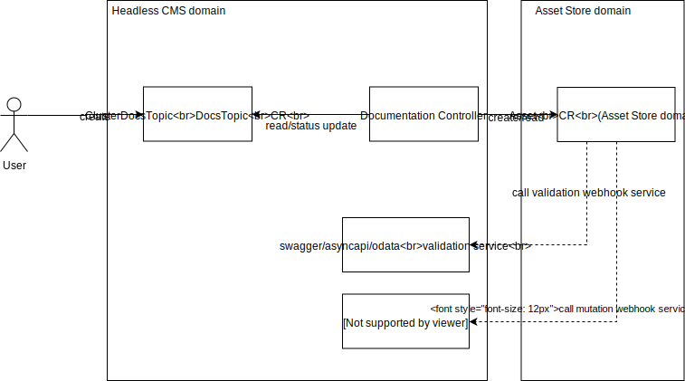

# New Architecture for Documentation and Specifications Management

Created on 2018-10-13 by Lukasz Gornicki (@derberg).

## Status

Proposed on 2018-10-16

## Motivation

1. To solve below technological dept
   - Current approach is based on 2 different ways of loading content sources into Minio
     - Throught a docker image to Minio
     - Application Connector through the Metadata Service directly to Minio
   - No single validation component
   - To get content in the UI we have 2 different places to define details, 
     - config located in docs sources
     - navigation manifesto where you define topic name and id
2. To enable single solution for any type of docs and make it possible for users to easily reuse our solution for their needs
3. Enable modularization for minio, so it can be easily replaced by s3 and not maintain a special cache for docs in ui-api-layer
4. Enable modularization of documentation, so you can load documentation only for modules that are installed in Kyma

## Solution

Implement below proposal on top of new [Assets Store](https://github.com/kyma-project/community/blob/master/sig-and-wg/sig-core/proposals/asset-store-proposal.md)



### DocsTopic and ClusterDocsTopic
- All details of a given documentation topic, including doc soureces are specified with custom resource (DocsTopic or ClusterDocsTopic)
- Supported formats: markdown + assets, swagger, asyncapi, odata
- Documentation can be provided in different formats:
  - in a zip/tar.gz format
  - different location of docs or specs can be provided, in case of docs and assets you point to an index with names of the files available under given link
  - mixcure of above is possible

```
---
apiVersion: documentation.kyma-project.io/v1alpha1
kind: ClusterDocsTopic
metadata:
  name: service-catalog #example based on current documentation topic https://github.com/kyma-project/kyma/tree/master/docs/service-catalog
  labels:
    viewContext: docs-view
spec:
  description: Overal documentation for Service Catalog
  displayName: Service Catalog
  source:
    docs: 
       index: https://some.domain.com/index.yaml
       package: https://some.domain.com/kyma.zip
    specs:
      swagger: 
        url: https://some.domain.com/swagger.yaml
        rewrites: 
          basePath: /test/v2
      asyncapi: 
        url: https://some.domain.com/asyncapi.yaml
      odata: 
        url: https://some.domain.com/odata.xml
status:
  ready: False
  reason: ValidationFailed # or UploadFailed or SourceFetchFailure
  message: "swagger file is not a valid json"
#status:
#  ready: True
#  resource:
#    docsUrl: 
#      index: $LINK-TO-INDEX
#       apiVersion: v1
#         files:
#         - name: 01-overview.md
#           metadata:
#             title: MyOverview
#             type: Overview
#         - name: 02-details.md
#           metadata:
#             title: MyDetails
#             type: Details
#         - name: 03-installation.md
#           metadata:
#             title: MyInstallation
#             type: Tutorial
#         - name: assets/diagram.svg
#    spec:
#      swagger: $LINK-TO-FILE
```

### Documentation Controller

This controller is responsible for creating Asset custom resource (CR) from AssetStore. In case DocsTopic CR contains information about different formats, like docs in zip and also direct link to some spec, then Documentation Controller is then responsible for creating 2 different Asset CRs.

Documentation Controller monitors the status of Asset CR and updates the status of DocsTopic CR. 
Asset CRs created by Documentation controller should not be removable while related DocsTopic CR exists. They can only be removed by Documentation controller if DocsTopic CR is deleted

## Possible extensions -> Service Catalog case

When you register a ServiceBroker, Catalog Docs controller listens to all newly addedded ServiceClasses to the Catalog and creates for them DocsTopic or ClusterDocsTopic CR. 


Such ServiceClass on which controller reacts must contain `external.metadata.content` object as shown below:

```
package: https://some.domain.com/kyma.zip
    docs: https://some.domain.com/index.yaml
    specs:
      swagger: 
        url: https://some.domain.com/swagger.yaml
        rewrites: 
          basePath: /test/v2
      asyncapi: 
        url: https://some.domain.com/asyncapi.yaml
      odata: 
        url: https://some.domain.com/odata.xml
```

For docs cleanup reasons (unregister broker case), controller during CR creation specifies an `ownerReference` pointing to the ServiceClass. The controller will make sure that for such use case it will add a finalizer to the DocsTopic CR and not allow its deletion until storage is really cleaned up.
