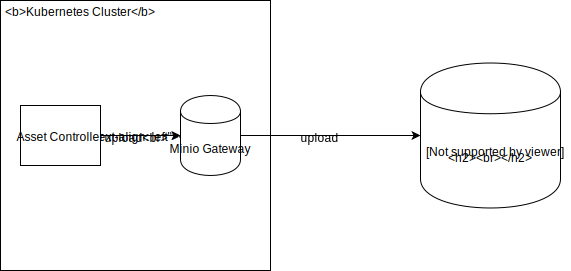

# Objects Store

Created on 2019-01-03 by Lukasz Gornicki (@derberg).

## Status

Proposed on 2019-01-04

## Motivation

1. Have a generic solution for storing in s3 like storage any kind of object: zip file, markdown file, PNG or JS (JavaScript)
2. Have a storage solution not locked to one vendor, like AWS S3 only, or like to Minio on-premise only
3. Have a storage solution that not only stores the file but also exposes it directly to internet

## Use case

1. Storage for documentation and related images
2. Storege for API specifications
3. Storage for static client-side applications

## Solution

A new custom solution called ObjectStore.


1. Location of the object is specified in the Object custom resource.
2. Object controller fetches the object basing on the information given in the custom resource.
3. The controller performs:
    - Mutation of the object by communicating with mutation webhook specified in the custom resource
    - Validation of the object by communicating with mutation webhook specified in the custom resource
    - New file creation, if such file was referenced in the resource definition as a ConfigMap
    
   If any of above operations failed, controller updates the resource with `ready: False` status  
4. Controller uploads the object to minio to a bucket that name is specified in the custom resource. You need a bucket to upload objects, you create it separately as a Bucket custom resource
5. Controller updates the status of the Object custom resource with information about location of the file

### Bucket custom resource

You might want to use different bucket per solution. This is why you need to be able to specify multiple buckets for different Object. For example one bucket for documentation and one bucket per Web application.

Another use cases for having multiple Buckets configuration:
- Future extensibility by alowing bucket policy specification per solution
- Minio doesn't support setting a bucket to behave as a static website host. Future controller of the Bucket custom resource will have to handle this additional functionality
- Minio doesn't support setting a CDN for your objects. Future controller of the Bucket custom resource will have to handle this additional functionality. For example controller will be reesponsible for configuring a CloudFront for your bucket on S3

Example resource for first version of the ObjectStore:
```
apiVersion: bucket.objectstore.kyma-project.io/v1alpha1
kind: Bucket
metadata:
  name: my-bucket
  namespace: default
#ObjectStore 2.0  
#spec:
#  policy: public #or other policies
status:
  ready: False
  reason: BucketCreationFailure
  message: "service unavailable"
```

You reference the Bucket in your Object CR with the following info in the spec:
```
  bucketRef:
    name: my-bucket
```

It must be provided because the Object controller checks the Bucket custom resource status to make sure the bucket exists.

## Object custom resource

Object resource mandatory information is the:
- reference info about the source file/object location that must be fetched by Object controller with 2 different modes:
  - `single` - the link points directly to object that needs to be fetched
  - `index` - the link to index.yaml file that contains reference to files that need to be separately fetch from a given relative location
  - `package` - the link to the zip/tar file that must be unziped before it is uploaded
```
#sample of index file with markdown and assets files
apiVersion: v1
files:
  - name: 01-overview.md
    metadata:
      title: MyOverview
      type: Overview
  - name: 02-details.md
    metadata:
      title: MyDetails
      type: Details
  - name: 03-installation.md
    metadata:
      title: MyInstallation
      type: Tutorial
  - name: assets/diagram.svg
```
- reference to the bucket where the object should be stored

```
apiVersion: object.objectstore.kyma-project.io/v1alpha1
kind: Object
metadata:
  name: my-package-objects
  namespace: default
spec:
  source:
    mode: single # or index or package
    url: https://some.domain.com/main.js
  bucketRef:
    name: my-bucket
```

The optional information is the:
- ConfigMap reference, that points to the ConfigMap that introduces [a new file](https://github.com/kyma-project/kyma/blob/master/resources/core/charts/service-catalog-addons/charts/instances-ui/templates/configmap.yaml) that is also sent to the bucket along with other files
- Rewrites information. Easy way of object modification before it is uploaded to the bucket, through `regex` operation or `keyvalue`
```
  #keyvalue example for use case of swagger file rewriting
  rewrites:
      - keyvalue: 
          basePath: /test/v2
  #regex example for documentation modification in the markdown       
  rewrites:
      - regex: 
          find: \stitle="(.*)?"\s*(/>*)
          replace: $2<title>$1</title>          
```
- ObjectValidationWebhook reference to a service that performs the validation of fetched objects before they are uploaded to the bucket. The use cases are:
  - validation of specific file agains some specification
  - security validation

```
apiVersion: objectstore.kyma-project.io/v1alpha1
kind: Object
metadata:
  name: my-indexbased-objects
  namespace: default
spec:
  source:
    mode: index
    url: https://some.domain.com/index.yaml
    rewrites:
      - regex: 
          find: \stitle="(.*)?"\s*(/>*)
          replace: $2<title>$1</title>
  filesFrom:
    - configMapRef:
        name: additional-object
    - configMapRef:
        name: one-more-object
  bucketRef:
    name: my-bucket
status:
  ready: True
  objects:
    - url: https://some.storage.domain/01-overview.md
      metadata:
        title: MyOverview
        type: Overview
    - url: https://some.storage.domain/02-details.md
      metadata:
        title: MyDetails
        type: Details
    - url: https://some.storage.domain/assets/diagram.svg
---
apiVersion: objectstore.kyma-project.io/v1alpha1
kind: Object
metadata:
  name: my-direct-objects
  namespace: default
spec:
  source:
    direct: https://some.domain.com/my.json
    validationWebhookService:
        name: swagger-validation-svc
        namespace: kyma-system
    rewrites:
      - keyvalue: 
          basePath: /test/v2
  bucketRef:
    name: my-bucket
status:
  ready: False
  reason: Validation failure
  message: "file is not valid against provided json schema"
```

## ObjectValidationWebhook details

ObjectStore must provide a flexible way of validating the objects before they are uploaded to the bucket. Different use cases bring different validation requirements. The best way is to do it by introducing a webhook that will receive an object for validation and reply to the controller with defined status schema

1. Controller calls the `/validate` endpoint of the given service in a given namespace
```
validationWebhookService:
  name: swagger-validation-svc
  namespace: kyma-system
```
2. The service gets the following payload and be default must reply within 1sec:
```
{
    name: my-direct-objects
    namespace: default
    objects: {
      name1: "content",
      name2: "content"
    }
}
```
3. The controller:
   - times out after 1sec because of no response and updates the status of the Object to False
   - gets response with successful or failing validation in the following for:
```
{
   status: {
     name1: {
       status: Failure,
       message: "much more details of the failure"
     },
     name2: {
       status: Success,
       message: "much more details"
     }
   }
}
```
4. If at least one object failed the validation the status of the Object is set to False and proper message about a given object is added to the status. Otherwise the status is set to True and object uplodaded to the bucket

## Minio local vs cluster modes

Mino as a storege supports Kyma's manifesto and the rule of `bateries included`. It makes development easier. Nevertheless for production usage Minio should be used in a [gateway mode](https://github.com/minio/minio/tree/master/docs/gateway). Gateway mode gives you a flexibility of using object storage from any major cloud provider like Google/Amazon/Microsoft without modifications in the Object controller as it talks to the Minio/Minio Gateway with the same S3 API



