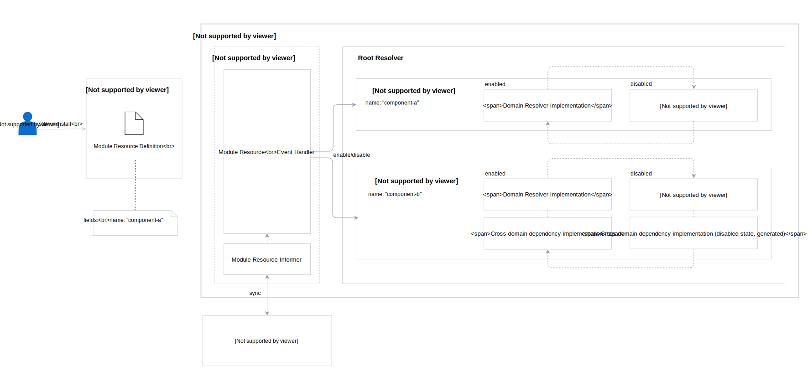

# UI API Layer Modularization

Created on 2018-29-11 by Paweł Kosiec (@pkosiec).

## Status

Proposed on 2018-11-29.

## Motivation

UI API Layer exposes GraphQL API for the Kyma Console. It consists of resolver logic for different domains, like Kubernetes, Service Catalog, Remote Environments, Kubeless, etc. As Kyma needs to be modularized, users should be able to install only the components they need.

Current approach we use in UI API Layer makes it impossible. During the GraphQL server start, we try to synchronize Stores of all Informers. In a result, if a resource of a specific type doesn't exist, UI API Layer won't start properly, because its Informer will return an error.

## Goal

1. There should be an ability to turn on and off specific UI API Layer modules, even on server runtime.
1. If user tries to access queries/mutations/subscriptions of a specific domain, which is related with not installed Kyma component, UI API Layer should return an error about uninstalled domain.

## Suggested solution

The solution is based on a Custom Resource, which is defined for all Kyma components which have equivalents in UI API Layer as different domains (`domain` package). In this proposal it is called as **Module**.

By default, during start, UI API Layer has all domains disabled, which means there will be no informers synced for all resources related to GraphQL queries/mutations/subscriptions.

Using generated Informer API for the **Module** resource, an event handler is created for every resolver domain. On create/update/delete events the handler is triggered, and it enables/disables according domain.

Enabling a domain means everything what it is currently done in domain resolver constructor (services, informers setup etc), as well as starting informers and waiting for cache synchronization.

Disabling a specific domain stops the informer synchronization, unregisters subscription listeners and replaces domain resolver logic to generated one, which always returns an error (e.g. `Module {MODULE_NAME} is not installed`). 

Generator could be based on [Impl](https://github.com/josharian/impl) - but it will need a modification: instead of panicking, it should return error gracefully for every method.

### Architectural Diagram



### Custom Resource Definition

The proposed Custom Resource Definition is as follows:

```yaml
apiVersion: apiextensions.k8s.io/v1beta1
kind: CustomResourceDefinition
metadata:
  name: modules.uiapi.kyma-project.io
spec:
  group: uiapi.kyma-project.io
  version: v1alpha1
  scope: Cluster
  names:
    plural: modules
    singular: module
    kind: Module
    shortNames:
    - mod
```

The only required field is unique name of the resource.

Extending existing custom resource, `Microfrontend` and `ClusterMicrofrontend` has been considered. //TODO:

### Steps to make a module pluggable

1. Prepare Module resource YAML in chart of the particular Kyma component with unique name:
    ```yaml
    apiVersion: uiapi.kyma-project.io/v1alpha1
    kind: Module
    metadata:
    name: k8s
    ```
1. Create interface for the domain resolver/container with all exported methods
1. Generate disabled state implementation for the created interface
1. Implement `PluggableModule` interface for domain resolver/container:
    ```go
    type PluggableModule interface {
        Enable() error
        Disable() error
        IsEnabled() bool
        Name() string
    }
    ```

### Proof of Concept

The PoC has been created in [PR #1849](https://github.com/kyma-project/kyma/pull/1849/files) for Kyma repository. It contains pluggable `k8s` domain as an example.