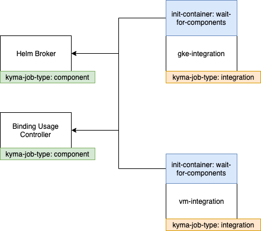

# Update component and its chart in one pull request

Created on 2019-XX-04 by Adam Szecowka (@aszecowka) and Pawel Kosiec (@pkosiec). 

## Status
Proposed on 2019-XX-04.

## Motivation
Currently, when a developer introduces changes to his component, he needs to do at least 2 PR:

- Changes made to the component
- Bump image version in the chart

Such an approach has many drawbacks:

- Slow development cycle, dealing with 2 PRs, asking for approvals twice
- A developer can forget to bump image and version can be updated only on the release day. Updating version on the release day is 
a worst case scenario, because we postponed integration of our components. This is against Continuous Integration approach.
- The code in the repository does not reflect what is really running.

## Goal
- Kyma developer can introduce his changes to Kyma in one Pull Request. Changes to the component and helm chart where we update component version is done in the same PR.
- The code in the Kyma repository reflects code executed on the Kyma.
When doing a release we rebuild all components. We should not be surprised on the release day that some tests are failing because some component was not updated for 3 weeks
- Kyma repository has a nice commit history and commits that only bumps a component version are rare.
- Run Kyma integration tests with the modified component within the same pull request status checks

## Suggested solution

**Allow to use images built on Pull Requests**

Let assume that I am working on PR-1234. When I modify `componentA`, Presubmit jobs builds Docker image. 
In values.yaml instead of:
```
component_a:
  dir: develop/
  version: 7cacbc23
```  
we will have:
```
component_a:
  dir: pr/
  version: PR-1234
```

With this approach, Prow executes component's and integration's jobs for the same PR. We have to ensure proper order of jobs,
to build component, before using it in the integration job. To achieve that, we can add init-container for integration jobs that 
waits until all component's jobs will be finished.



To read more details, see [Prow Job Dependencies](#poc-prow-jobs-dependencies).
At the beginning, we can use it as an option, a developer can decide if he update code and chart in the same PR. 
As a next step, we can introduce a job that checks if version of the chart is updated in the PR. To read more details, 
see [Job enforcing changes in one PR](#poc-job-enforcing-changes-in-one-pr).


### [POC] Prow Jobs Dependencies
Prow reacts on changes to the PR by creating ProwJob CR for all jobs to be executed for specific PR. Generally, we have 
two kind of jobs:
- component jobs, that creates Docker images. These jobs are executed only if we modify given job, Prowjobs 
 have specified parameter `run_if_changed`
 - integration jobs, that depends on component jobs. They are executed when `resources` or `installation` directory were modified.
 If we implement described here concept, these jobs will be executed on almost every PR. List of all integration jobs:
    * `pre-master-kyma-integration`
    * `pre-master-kyma-gke-integration`
    * `pre-master-kyma-gke-upgrade`
    * `pre-master-kyma-gke-central-connector`
    
To distinguish 2 types of jobs, we should label jobs, as it is presented on the diagram above:
- components jobs have label: `kyma-job-type: component`
- integration jobs have label: `kyma-job-type: integration`

All integration jobs have to have init-container, to postpone it's execution until all components jobs finished.
Init container has following logic:
```
fetch all prowjobs that current job depends:
- get all ProwJobs for given PR
- filter out ProwJobs for given PR but were triggered for previous commits
- filter out ProwJobs that don't build components (don't wait for other integration jobs)

if all jobs succeeded 
    exit init-container with status 0 - integration job will be executed
else
    exit init-container with status 1 - integration job will fail but without execution
``` 

Prow defines maximum number of concurrently executed jobs.There could be a extremely rare situation, that 
Prow executes only integration jobs that all wait for components jobs that cannot be executed because maximum
number of concurrent jobs was reached. Init container script should detect such situation and exit init container. 
In such case, a developer has to trigger integration job manually. 


### [POC] Job enforcing changes in one PR
To require updating charts immediately, a new Presubmit job should be defined. Below you can find it's pseudocode:
```
- get component's changed in current PR (ignore markdown files)
- check if chart uses current version. Use Makefile target "path-to-referenced-charts"
```
Still, there should be an option to merge a PR without updating a chart. In such case, a PR should have label, for
example: `postpone-integration` and Presubmit job described above should succeed immediately.   
