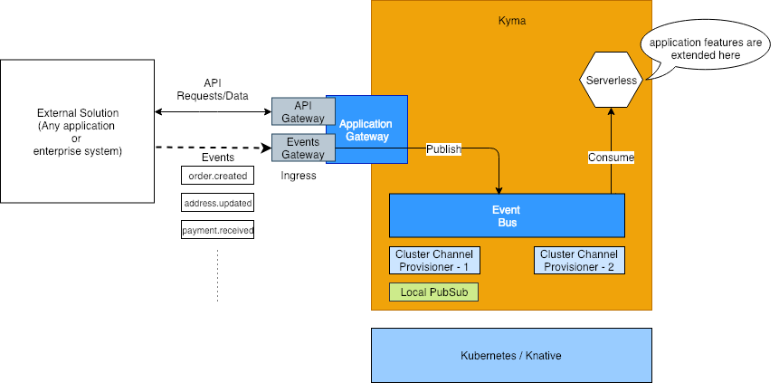
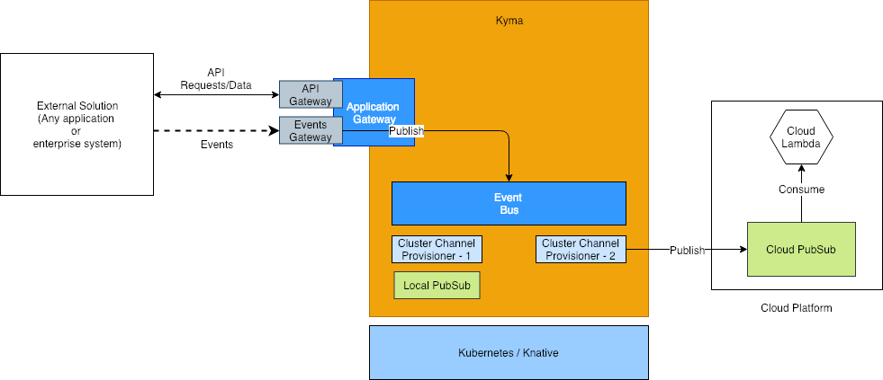
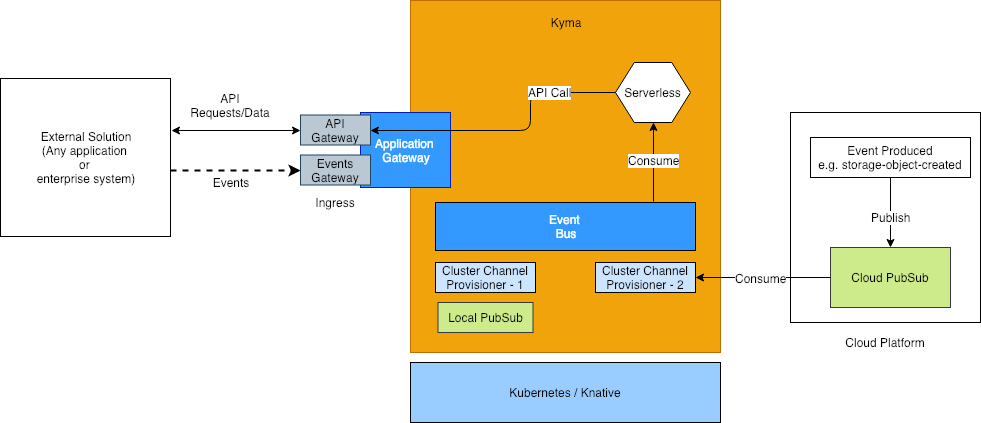

# Context

Kyma allows you to extend, integrate and modernize your monoliths, legacy applications or third-party systems in a cloud-native fashion. Kyma uses event drive architecture to achieve it.

# Use case 1: Extensibility & Integration
Existing applications can capture the business happenings as events.  Some examples are `invoice.created`, `payment.received`, `order.changed` and so on.

These events can then be transferred to Kyma via the Application Gateway.

Application developers can build serverless applications (lambdas and microservices) in Kyma to act on these events thus extending the existing application.

* Application preregisters the event-schema for the events it wishes to send to Kyma.
* Event schema is defined in [Async API format](https://github.com/asyncapi/asyncapi)
* The events registered by the external solutions can be updated. This implies event schemas can change, new event schemas can be added or existing ones can be removed. Such changes need to be cascaded to the underlying layer which will be Knative eventing.
* Application developers only deal with event types domain. They have no knowledge or coupling with the underlying messaging system.
* Events are stored centrally. Event Bus is a core component.
* Event origin is defined using identifiers and the identifiers are used for the data partition. e.g. `customer.created` event from `Application X` is segregated from `customer.created` event from `Application Y`.

**Integrating Applications**

Event-driven computations in Kyma can also be used to integrate two or more applications in the customer ecosystem.

Events produced by `Application X` can be used to trigger workflows in `Application Y` via APIs and vice-versa.

# Use case 2: Asynchronous workflows
Application developers can build serverless applications in Kyma which produce internal events. These events can be used to trigger serverless applications that consume these events thereby creating an asynchronous pipeline or workflow.

# Use case 3: Integrating third-party messaging systems
Kyma can be used to integrate third-party messaging systems (including cloud solutions such as `Google PubSub`). A business happening in the application can be captured as an event in Kyma. This event can then be stored in the cloud eventing system such as `Google PubSub`. Based on the event, serverless computations can be triggered in GCP to achieve a business scenario.

An event in the third party messaging system such as `Google PubSub` can be captured by Kyma to trigger a business action in the application.

